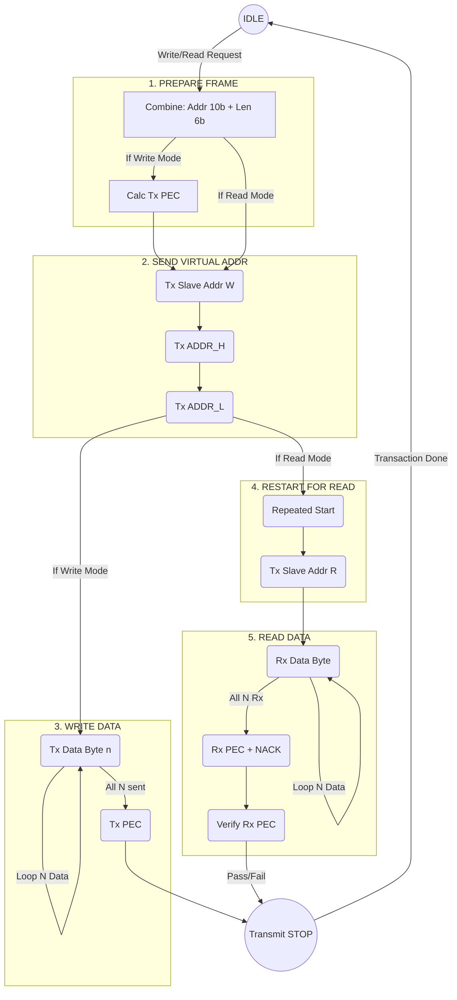

# D02_2_3_I2CA_MASTER_TO_M0G3519

# [設計提案] I2CA 擴充 IO 與狀態控制通訊架構設計 (M0G3519)

## 1. 目標 (Objective)

設計 C2000 (CPU1, 扮演 I2CA Master) 與 M0G3519 (扮演 I2C Slave, 負責擴充 IO 與狀態控制) 之間的通訊機制作法。為了優化兩顆 MCU 之間的交握效率與確保資料正確性，在標準 16-bit EEPROM 格式的基底上，我們外掛一層應用層協定 (Application Layer Protocol)：將送出的 16-bit 位址重新切分為 **10-bit 實體位址 (Address) + 6-bit 資料長度 (Data Length)**，並在傳輸的 Byte 資料陣列最後，強制附加一個 **SMBus PEC (Packet Error Checking)** 校驗碼。系統仍以「背景輪詢狀態機 (Background Polling State Machine)」方式運作，確保不干擾 CPU1 高頻即時中斷 (100kHz)。

## 2. 架構 (Architecture)

根據本專案的 `D02_COMM_ARCHITECTURE.md` 規範：
- **硬體層**：C2000 I2CA (Master) <–> M0G3519 I2C (Slave)，設定適當的 Pull-up 電阻與傳輸速率 (100kHz)。
- **軟體層**：
- CPU1 主迴圈 (Main Loop) 執行非阻塞式的狀態機 (Non-blocking State Machine)。
- 將 M0G3519 的控制邏輯抽象化為 10-bit 的「虛擬暫存器位址空間 (Virtual Register Map)」。
- M0G3519 收到指令後，必須驗證 SMBus PEC，並依據 6-bit 長度來決定要收/發多少 Bytes 的有效資料。

## 3. 資料格式設計 (Data Format: 10-bit ADDR + 6-bit LEN + N Bytes Data + 1 Byte PEC)

在 I2C 總線上，通訊的外觀完全等同於標準的「16-bit 位址 EEPROM 連續讀寫」。但內容被賦予了新的意義：

### 3.1 虛擬位址定義 (Virtual 16-bit Address Pointer)

Master 發出的 16-bit `[ADDR_H]` 與 `[ADDR_L]`，其 Bit 結構定義如下：
- **Bit 15 ~ Bit 6 (10 bits)**: `Memory Address` (實體暫存器位址，0x000 ~ 0x3FF)
- **Bit 5 ~ Bit 0 (6 bits)**: `Data Length (N)` (有效資料 Byte 數量，1 ~ 63)

### 3.2 寫入流程 (Write Sequence)

C2000 向 M0G3519 寫入資料 (指令/參數/模式更新)。總共會寫入 `N+1` 個 Bytes（最後一 Byte 為 PEC）。
- **Sequence**: `Start` -> `[Slave_Addr(W)]` -> `[ADDR_H]` -> `[ADDR_L]` -> `[Data_Byte_1]` … -> `[Data_Byte_N]` -> `[PEC]` -> `Stop`*(註：M0G3519 在接收到 `Stop` 訊號後，開始驗證 PEC 是否吻合所有接收的位元組。若吻合則將資料正式寫入指定的 `Memory Address`。)*

### 3.3 讀取流程 (Read Sequence)

C2000 向 M0G3519 要求讀取狀態或資料。Master 接收總數必須為 `N+1` 個 Bytes。
- **Step 1 (寫入欲讀取的位址與長度)**: `Start` -> `[Slave_Addr(W)]` -> `[ADDR_H]` -> `[ADDR_L]`
- **Step 2 (重啟並接收資料與校驗)**: `Repeated Start` -> `[Slave_Addr(R)]` -> `[Data_Byte_1]` … -> `[Data_Byte_N]` -> `[PEC (NACK)]` -> `Stop`*(註：M0G3519 收到 Step 1 後，需解析出要回傳 `N` 個 Bytes，並在尾部附上這 N 個 Bytes 加上雙邊位址資訊所算出的 `PEC`。Master 讀完 PEC 後發送 NACK 與 Stop，隨後進行本地驗證，驗證通過資料才算有效。)*

### 3.4 封包位元與結構圖 (Packet Structure Diagram)

### 16-bit 虛擬位址解析 (Virtual Address Bit-Mapping)

| Byte | Bit 7 | Bit 6 | Bit 5 | Bit 4 | Bit 3 | Bit 2 | Bit 1 | Bit 0 |
| --- | --- | --- | --- | --- | --- | --- | --- | --- |
| **ADDR_H** | MemAddr_9 | MemAddr_8 | MemAddr_7 | MemAddr_6 | MemAddr_5 | MemAddr_4 | MemAddr_3 | MemAddr_2 |
| **ADDR_L** | MemAddr_1 | MemAddr_0 | Length_5 | Length_4 | Length_3 | Length_2 | Length_1 | Length_0 |

### 寫入封包結構 (Write Packet)

| 週期 | 1 | 2 | 3 | 4 | 5 | … | N+4 | N+5 |
| --- | --- | --- | --- | --- | --- | --- | --- | --- |
| **匯流排資料** | `START` | `Slave_W` | `ADDR_H` | `ADDR_L` | `Data(1)` | … | `Data(N)` | `PEC` |
| **傳送者** | Master | Master | Master | Master | Master | Master | Master | Master |
| **PEC 涵蓋** | ➖ | 🏁 起點 | ✅ | ✅ | ✅ | ✅ | ✅ | 🏁 終點 |

### 讀取封包結構 (Read Packet)

| 週期 | 1 | 2 | 3 | 4 | 5 | 6 | 7 | … | N+6 | N+7 |
| --- | --- | --- | --- | --- | --- | --- | --- | --- | --- | --- |
| **匯流排資料** | `START` | `Slave_W` | `ADDR_H` | `ADDR_L` | `Re-START` | `Slave_R` | `Data(1)` | … | `Data(N)` | `PEC(NACK)` |
| **傳送者** | Master | Master | Master | Master | Master | Master | Slave | Slave | Slave | Slave |
| **PEC 涵蓋** | ➖ | 🏁 起點 | ✅ | ✅ | ➖ | ✅ | ✅ | ✅ | ✅ | 🏁 終點 |

## 4. 流程圖 (Flow / DOT)



## 5. 功能說明 (Function Description)

- **虛擬位址解析與長度依賴 (Virtual Address Parsing)**：
    - M0G3519 硬體 I2C Slave 雖被視為 EEPROM，但韌體必須解析前 2 個 Bytes (`ADDR_H`, `ADDR_L`) 來獲取 `Data_Length` (`ADDR_L & 0x3F`)。
    - **為何不能等最後才解析？**
        - **寫入 (Write)** 時的確可以等收到 `STOP` 且驗證 `PEC` 正確後，再來慢慢解析位址並把暫存區 Payload 搬入實際記憶體，這點非常安全。
        - **讀取 (Read)** 時，由於 I2C 協定的限制，Master 會在發送完 `ADDR` 之後，馬上發出 `Repeated Start` 並切換為讀取模式 (`Slave_R`)。這時候 Slave **必須立刻**把對應長度的資料逐一放入 TX FIFO 交還給 Master。因此，Slave 必須在收到 `ADDR` 的當下，就「提前解析」出自己該去哪裡抓資料，以及要準備傳送多少個 Bytes (長度 N)，最後還要預先算好回傳的 `PEC` 放在第 `N+1` 個 Byte 上。
    - 因此，長度與位址的解析在「讀取流程」中具備高度即時性要求。對於非法長度或不存在的範圍要求，Slave 應回傳 `0xFF` 假資料並計算對應的 PEC 讓指令正常結束，但不做任何實質動作。
- **標準 SMBus PEC 錯誤檢查**：
    - **演算法規範**：採用標準 SMBus/PMBus 規範的 Packet Error Checking (PEC)。底層實質為 CRC-8，多項式 (Polynomial) 為 `X^8 + X^2 + X^1 + 1`，其 Hex 數值為 `0x07`。
    - **初始值 (Initial Value)**：`0x00`。
    - **涵蓋範圍 (Coverage)**：從第一個 `START` 訊號開始的第一個 Address Byte 一路算到最後的資料 Byte 結束。
        - **寫入時**：包含 `[Slave_Addr(W)]`, `[ADDR_H]`, `[ADDR_L]`, `[Data_1]` … `[Data_N]`。
        - **讀取時**：包含 `[Slave_Addr(W)]`, `[ADDR_H]`, `[ADDR_L]`, (Repeated Start), `[Slave_Addr(R)]`, `[Data_1]` … `[Data_N]`。
- **效率優化**：
    - 長度融合在 EEPROM 的 16-bit 虛擬位址中，不需要額外增加一 Byte 傳送宣告；而 PEC 標準防護則為通訊可靠性提供了不可妥協的底線保障。

## 6. 參數說明 (Parameters)

- **Slave Address**: M0G3519 設備位址 (7-bit)，例如 `0x30`。在計算 PEC 時，包含 R/W bit，故 Write Addr 為 `0x60`，Read Addr 為 `0x61`。
- **Virtual Address (16-bit)**:
    - `ADDR_H`: `Bit[15:8]` = `Mem_Addr[9:2]`
    - `ADDR_L`: `Bit[7:0]` = `Mem_Addr[1:0] (Bit 7:6) | Length[5:0] (Bit 5:0)`
- **資料長度決定機制 (N)**: `Length[5:0]` 決定**有效資料(Data)**的總 Bytes 數。傳送的實際總資料長度為 `N + 1 (PEC)`。
- **PEC (Packet Error Code)**: 1 Byte。SMBus 標準 CRC-8，多項式 0x07。

## 7. 注意事項 (Notes)

1. **防禦性程式設計 (NACK & Drop)**：在讀取與寫入時，如果 M0G3519 發現接收的 `[PEC]` 計算結果不正確，**絕對不能**套用該筆資料。讀取時若 Master 發現 M0G3519 回傳的 `[PEC]` 錯誤，Master 應將該次讀值丟棄並排程重試。
2. **PEC 涵蓋 Slave Address**：這點最容易忽略。SMBus 的 PEC 並不是只算 Payload，**連夾帶 R/W bit 的從端硬體位址也要納入計算**。這可以防止由於匯流排上硬體位址被干擾而將資料錯寫給其他 I2C 設備。
3. **無中斷死等 (No ISR Deadlock)**：C2000 端通訊進度透過 Polling 來推進，不干擾高頻控制迴圈。
4. **PEC 計算效能與實作參考 (Lookup Table)**：
為了避免在通訊輪詢時佔用太多 CPU 算力，請務必在雙方針對 SMBus PEC (CRC-8, Polynomial `0x07`) 採用查表法實作。以下提供 256 Bytes 的查表陣列供韌體直接套用：
    
    ```c
    // SMBus PEC / CRC-8 (Polynomial 0x07, Initial Value 0x00)
    const uint8_t pec_table[256] = {
        0x00, 0x07, 0x0E, 0x09, 0x1C, 0x1B, 0x12, 0x15, 0x38, 0x3F, 0x36, 0x31, 0x24, 0x23, 0x2A, 0x2D,
        0x70, 0x77, 0x7E, 0x79, 0x6C, 0x6B, 0x62, 0x65, 0x48, 0x4F, 0x46, 0x41, 0x54, 0x53, 0x5A, 0x5D,
        0xE0, 0xE7, 0xEE, 0xE9, 0xFC, 0xFB, 0xF2, 0xF5, 0xD8, 0xDF, 0xD6, 0xD1, 0xC4, 0xC3, 0xCA, 0xCD,
        0x90, 0x97, 0x9E, 0x99, 0x8C, 0x8B, 0x82, 0x85, 0xA8, 0xAF, 0xA6, 0xA1, 0xB4, 0xB3, 0xBA, 0xBD,
        0xC7, 0xC0, 0xC9, 0xCE, 0xDB, 0xDC, 0xD5, 0xD2, 0xFF, 0xF8, 0xF1, 0xF6, 0xE3, 0xE4, 0xED, 0xEA,
        0xB7, 0xB0, 0xB9, 0xBE, 0xAB, 0xAC, 0xA5, 0xA2, 0x8F, 0x88, 0x81, 0x86, 0x93, 0x94, 0x9D, 0x9A,
        0x27, 0x20, 0x29, 0x2E, 0x3B, 0x3C, 0x35, 0x32, 0x1F, 0x18, 0x11, 0x16, 0x03, 0x04, 0x0D, 0x0A,
        0x57, 0x50, 0x59, 0x5E, 0x4B, 0x4C, 0x45, 0x42, 0x6F, 0x68, 0x61, 0x66, 0x73, 0x74, 0x7D, 0x7A,
        0x89, 0x8E, 0x87, 0x80, 0x95, 0x92, 0x9B, 0x9C, 0xB1, 0xB6, 0xBF, 0xB8, 0xAD, 0xAA, 0xA3, 0xA4,
        0xF9, 0xFE, 0xF7, 0xF0, 0xE5, 0xE2, 0xEB, 0xEC, 0xC1, 0xC6, 0xCF, 0xC8, 0xDD, 0xDA, 0xD3, 0xD4,
        0x69, 0x6E, 0x67, 0x60, 0x75, 0x72, 0x7B, 0x7C, 0x51, 0x56, 0x5F, 0x58, 0x4D, 0x4A, 0x43, 0x44,
        0x19, 0x1E, 0x17, 0x10, 0x05, 0x02, 0x0B, 0x0C, 0x21, 0x26, 0x2F, 0x28, 0x3D, 0x3A, 0x33, 0x34,
        0x4E, 0x49, 0x40, 0x47, 0x52, 0x55, 0x5C, 0x5B, 0x76, 0x71, 0x78, 0x7F, 0x6A, 0x6D, 0x64, 0x63,
        0x3E, 0x39, 0x30, 0x37, 0x22, 0x25, 0x2C, 0x2B, 0x06, 0x01, 0x08, 0x0F, 0x1A, 0x1D, 0x14, 0x13,
        0xAE, 0xA9, 0xA0, 0xA7, 0xB2, 0xB5, 0xBC, 0xBB, 0x96, 0x91, 0x98, 0x9F, 0x8A, 0x8D, 0x84, 0x83,
        0xDE, 0xD9, 0xD0, 0xD7, 0xC2, 0xC5, 0xCC, 0xCB, 0xE6, 0xE1, 0xE8, 0xEF, 0xFA, 0xFD, 0xF4, 0xF3
    };
    
    // 實作範例:
    // uint8_t calc_pec(uint8_t crc, uint8_t data) {
    //     return pec_table[crc ^ data];
    // }
    ```
    

## 8. 參考說明 (References)

- `D02_COMM_ARCHITECTURE.md` - Section 2.3 擴充 IO 與狀態控制
- `D01_DESIGN_CONTROL_ARCHITECTURE.md`
- System Management Bus (SMBus) Specification (Section 5.3.1 Packet Error Checking)
- EEPROM I2C Read/Write Specifications