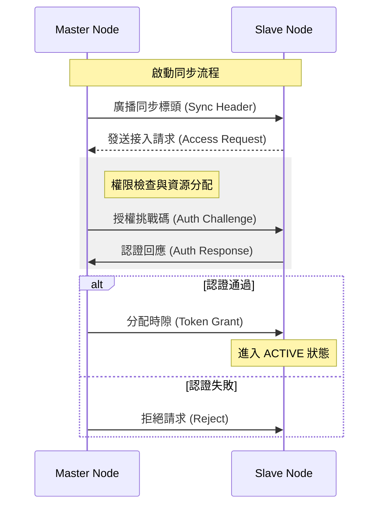

# M0_README

## 專案概述

ASR5000_M0 是一款基於 ARM Cortex-M0 架構的通訊處理模組，專為嵌入式低功耗環境設計。本系統實現了高精度的時分多址 (TDMA) 協議棧，支持多節點授權與同步傳輸。

## 系統互動行為 (System Interaction)

下圖描述了 Master (主節點) 與 Slave (從節點) 之間的授權授權與通訊交握流程。



## 底層時序分配 (Timing Allocation)

本系統採用固定週期的 TDMA 框結構，確保數位訊號傳輸的確定性。

```
{ "signal": [
  { "name": "Sys_CLK", "wave": "p..........." },
  { "name": "Frame_Sync", "wave": "1.0.........", "node": ".a.b" },
  { "name": "Node_Slot", "wave": "0..1110.....", "node": "...c..d" },
  { "name": "TX_Data", "wave": "x..=..x.....", "data": ["Data_Payload"] },
  { "name": "Interrupt", "wave": "0.......1.0.", "node": "........e.f" }
],
  "head": {
    "text": "TDMA 物理層時序圖",
    "tick": 0
  },
  "foot": {
    "text": "週期 = 10ms",
    "tock": 11
  }
}
```

## 封包結構與暫存器定義 (Packet & Register Map)

### 通訊封包結構 (Packet Structure)

定義底層通訊協議的標準封包格式。

```
{ "reg": [
  { "name": "Preamble", "bits": 8, "attr": "Sync Pattern", "type": 1 },
  { "name": "Device_ID", "bits": 12, "attr": "Address", "type": 2 },
  { "name": "Type", "bits": 4, "attr": "CMD/Data", "type": 3 },
  { "name": "Length", "bits": 8, "attr": "Payload Size", "type": 4 },
  { "name": "Payload", "bits": 32, "attr": "Data Content", "type": 5 },
  { "name": "CRC-8", "bits": 8, "attr": "Check Sum", "type": 6 }
], "config": { "bits": 72, "lanes": 1 }
}
```

### 控制暫存器結構 (Control Register MAP)

`0x4000_1000`：核心控制暫存器 (CTRL_REG0)

```
{ "reg": [
  { "name": "EN", "bits": 1, "attr": "Module Enable", "type": 1 },
  { "name": "IE", "bits": 1, "attr": "IRQ Enable", "type": 2 },
  { "name": "MODE", "bits": 2, "attr": "0:M, 1:S", "type": 3 },
  { "name": "RSV", "bits": 4, "attr": "Reserved", "type": 0 },
  { "name": "FREQ", "bits": 8, "attr": "Clock Dividor", "type": 4 },
  { "name": "BURST", "bits": 16, "attr": "Max Burst Len", "type": 5 }
], "config": { "bits": 32, "lanes": 1 }
}
```

## 狀態機邏輯 (State Machine)

系統內部狀態機轉換邏輯如下所示。

```
digraph G {
fontname="Microsoft JhengHei";
node[fontname="Microsoft JhengHei",shape=box,style=rounded];
edge[fontname="Microsoft JhengHei",fontsize=10];

RESET[shape=circle,label="重置"];
IDLE[label="閒置 (IDLE)"];
SYNCING[label="同步中 (SYNCING)"];
AUTH[label="身份驗證 (AUTH)"];
ACTIVE[label="數據傳輸 (ACTIVE)"];
FAULT[label="錯誤 (FAULT)",color=red];

RESET->IDLE;
IDLE->SYNCING[label="偵測到同步波形"];
SYNCING->AUTH[label="同步鎖定完成"];
AUTH->ACTIVE[label="認證成功"];
AUTH->IDLE[label="認證失敗"];
ACTIVE->IDLE[label="傳輸結束 / 超時"];

IDLE->FAULT[label="電壓異常"];
SYNCING->FAULT[label="時脈偏移過大"];
FAULT->RESET[label="人為手動重置"];
}
```

## 撰寫規範 (Documentation Standards)

- **語言**: 所有文件皆須以 **繁體中文** 撰寫，專有名詞可保留原文。
- **圖示**: 優先使用 Mermaid, WaveDrom 與 Graphviz (DOT) 進行技術描述。
- **語氣**: 應保持專業且簡潔的工程用語。

## 環境要求

- **工具鏈**: ARM GCC Toolchain (v9.0+)
- **模擬器**: QEMU-System-ARM
- **圖表查看**: 建議使用支援 Mermaid 與 WaveDrom 插件的 VS Code 或 GitHub。