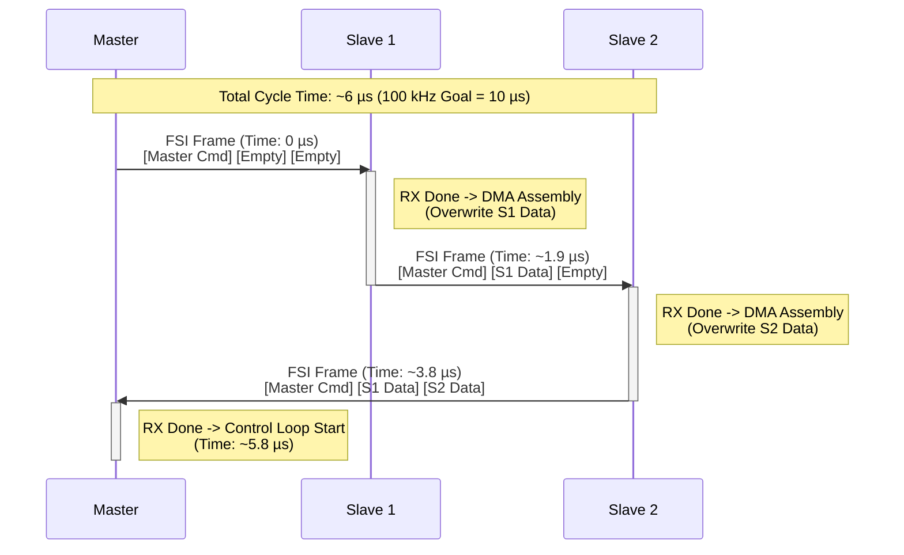

# R02_1_FSI_DESIGN

# R02_1 - FSI 通訊詳細設計 (FSI Communication Design)

## 1. 概述 (Overview)

本文件定義了分佈式系統中 FSI (Fast Serial Interface) 的通訊架構。設計目標為實現高頻寬、低延遲的 Daisy Chain 通訊，並具備自動拓樸偵測與故障診斷功能。

**關鍵規格**:
* **通訊架構**: Daisy Chain (Ring Topology)。
* **目標更新率**: **100 kHz (10 µs)**。
* **模組配置**: **1 Master + 2 Slaves** (因單一 RJ45 與封包容量限制，此架構極限支援至 3 台 Slaves)。
* **即時性策略**: **DMA + Frame Aggregation (單一聚合封包)**。

---

## 2. 物理層配置 (Physical Layer - PHY)

### 2.1 介面規格

- **信號標準**: **LVDS** (Low-Voltage Differential Signaling)。
    - **TX Driver**: `DSLVDS1047PWR` (具備 Output Enable 控制)。
    - **RX Receiver**: `DSLVDS1048PWR` (Always ON)。
- **連接介面**: **RJ45** (雙絞線，特性阻抗 100Ω)。
- **時脈頻率**: **50 MHz** (SCLK)。
- **傳輸模式**: **DDR (Double Data Rate)**。
    - **頻寬**: **100 Mbps / Lane** (2 Lanes = 200 Mbps)。

### 2.2 訊號完整性與延遲 (Signal Integrity & Skew)

由於使用 RJ45 長距離傳輸且運行於 50MHz DDR 模式，Clock 與 Data 之間的 **Skew (時序偏差)** 為關鍵挑戰。
* **解決方案**: 必須啟用 **RX Delay Line Control (TRM Section 32.3.3.6)**。
* **校正機制**: 實作軟體輔助的 **Ping/Training** 流程。

---

## 3. 時序校正機制 (Skew Compensation / Training)

本系統採用 **軟體輔助校正 (Software-Assisted Calibration)**，在系統初始化階段執行。

### 3.1 原理

利用 F28388D FSI 接收模組的 `RX_DLY_LINE_CTRL` 暫存器，對 RXCLK、RXD0、RXD1 訊號路徑引入微小延遲，以補償外部線路造成的 Skew。

### 3.2 校正流程 (Calibration Process)

1. **發送端 (TX)**: 持續發送標準 **PING Frame** (含 CRC 校驗)。
2. **接收端 (RX) 掃描**:
    - 進入軟體迴圈，依序調整 `RX_DLY_LINE_CTRL` 的 Tap 值 (例如 0~31)。
    - **注意**: 調整 Delay 前需確保 FSIRX 處於 **Soft Reset** 狀態。
    - 在每個 Tap 設定下，計算接收錯誤率 (CRC Error / Frame Error)。
3. **判斷有效範圍 (Valid Window)**:
    - 記錄所有無錯誤 (Pass) 的连续 Tap 範圍 (例如 Tap 5 ~ Tap 12 區間皆 Pass)。
4. **鎖定中心點 (Center Lock)**:
    - 計算有效範圍的中心值：`Optimal Tap = (Start + End) / 2`。
    - 寫入暫存器鎖定設定，完成校正。

---

## 4. 初始化與自動定址 (Initialization & Auto-Addressing)

在進入 100 kHz 高速控制迴圈前，系統必須先執行 **初始化階段** 以確認網路拓樸並分配 Slave ID。

### 4.1 硬體控制 (Hardware Control)

- **控制腳位**: `GPIO3` (Net Name: `EN_SLAVE`)。
- **功能**: 控制 FSI TX (LVDS Driver) 輸出。
    - `GPIO3 = 1`: **Enable TX** (允許資料傳往下級)。
    - **初始狀態**: 所有 Slave 預設為 **0 (Disable)**，阻斷下游通訊。

### 4.2 線上模組發現流程 (Online Module Discovery)

採用 **Token Passing** 機制進行自動定址。此階段使用 **軟體模式 (Software Control)** 運作，不使用 DMA。

1. **Reset**: 所有 Slave 重置，`ID = 0xFFFF`，`EN_SLAVE = 0`。
2. **Master 發起**: 廣播 `Discovery Frame` (User Data = 0)。
3. **Slave N 處理**:
    - 收到 Discovery Frame。
    - 設定 `MyID = Frame.UserData`。
    - 將 `Frame.UserData` 加 1。
    - 設定 `EN_SLAVE = 1` (開啟 TX)。
    - 轉發更新後的 Frame 給下一級。
4. **Loop Closure**: Master 收到 Frame，其 UserData 即為總節點數。
5. **Switch to DMA**: 完成定址後，Master 發送 `Switch_To_Run_Mode` 指令，所有節點切換至 **DMA 3-Stage Assembly** 模式，準備開始 100 kHz 通訊。

---

## 5. 高速資料流設計 (High-Speed Data Flow)

### 5.1 系統拓樸 (1 Master + 2 Slaves)

系統採用 **Daisy Chain** 架構，資料流向為：
`Master (TX)` -> `Slave 1 (RX/TX)` -> `Slave 2 (RX/TX)` -> `Master (RX)`

### 5.2 封包聚合策略 (Frame Aggregation)

為達成 **100 kHz (10 µs)** 更新率，系統採用 **單一聚合封包 (Single Aggregated Frame)** 策略，以減少 Header Overhead 並極大化頻寬利用率。

- **封包結構 (Frame Structure)**:
    - 使用 FSI **16 Words Data Frame** (Frame Type 視 User Data 而定)。
    - 總資料量: **14 Words** (符合單一 Frame 容量限制)。

| Word Index | Content | Source | Destination | Description |
| --- | --- | --- | --- | --- |
| **0 ~ 5** | `M_Ref [0..5]` | Master | All Slaves | Master 發出的參考指令 (L1/L2/L3 Ref, CV_AD, FuncID, Data) |
| **6 ~ 9** | `S1_Data [0..3]` | Slave 1 | Master | Slave 1 的回授資料 (Vout, Iout, FuncID, Data) |
| **10 ~ 13** | `S2_Data [0..3]` | Slave 2 | Master | Slave 2 的回授資料 (Vout, Iout, FuncID, Data) |

### 5.3 傳輸流程 (DMA 3-Stage Assembly)

為實現 Slave 端「接收即轉發」且「自動覆寫」的高效邏輯，每個 Slave 將配置 **3 個 DMA Channels** 進行接力傳輸 (Chaining)。

### **Master (發起者)**

- **觸發**: EPWM SOC (控制週期開始)。
- **DMA**: 將完整 14 Words (含指令與空位) 搬至 TX Buffer，啟動 FSI 發送。
- **接收**: 等待 RX Frame Done，一次讀取回授資料。

### **Slave 1 (中繼站)**

- **觸發**: FSI RX Frame Done 觸發 DMA Channel A。
- **DMA Chain**:
    1. **DMA Ch A**: 搬移 `RX_Buf[0..5]` (Master 指令) -> `TX_Buf[0..5]`。完成後觸發 Ch B。
    2. **DMA Ch B**: 搬移 `S1_ADC_Result` (S1 數據) -> `TX_Buf[6..9]` (**覆寫**)。完成後觸發 Ch C。
    3. **DMA Ch C**: 搬移 `RX_Buf[10..13]` (空/舊數據) -> `TX_Buf[10..13]`。完成後 **觸發 FSI TX Start**。
- **效果**: S1 在極短時間內重組出包含自己數據的新封包並轉發。

### **Slave 2 (終點站)**

- **觸發**: FSI RX Frame Done 觸發 DMA Channel A。
- **DMA Chain**:
    1. **DMA Ch A**: 搬移 `RX_Buf[0..5]` -> `TX_Buf[0..5]`。
    2. **DMA Ch B**: 搬移 `RX_Buf[6..9]` (S1 數據) -> `TX_Buf[6..9]` (**保留 S1 數據**)。
    3. **DMA Ch C**: 搬移 `S2_ADC_Result` (S2 數據) -> `TX_Buf[10..13]` (**覆寫**)。
- **效果**: S2 補上最後一段數據，將完整封包 (M+S1+S2) 傳回 Master。

### 5.4 時序圖 (Timing Diagram)

以下展示單一控制週期的時序流程：

---

## 6. 效能與時序分析 (Performance Analysis)

### 6.1 參數設定

- **FSI Clock**: 50 MHz DDR (2 Lanes) = 200 Mbps。
- **Bit Time**: 5 ns。
- **Payload**: 14 Words (16-bit) = 224 bits。
- **Frame Overhead**: ~60 bits (Preamble, Header, CRC, EOF, Idle)。
- **總 Frame Bits**: ~284 bits。
- **Wire Time** (傳輸耗時): 284 bits × 5 ns ≈ **1.42 µs**。

### 6.2 延遲計算 (Latency Calculation)

假設採用 **Store-and-Forward** (RX 完成 -> CPU/DMA 處理 -> TX 啟動)：
* **單跳處理延遲 (Processing Latency)**: ~0.5 µs (DMA trigger + minimal CPU intervention)。
* **單跳總延遲 (Hop Latency)**: 1.42 µs (Wire) + 0.5 µs (Proc) ≈ **1.92 µs**。

**總迴圈時間 (Total Loop Time)**:
* 路徑: Master -> S1 -> S2 -> Master (共 3 Hops)。
* Total Latency = 1.92 µs × 3 ≈ **5.76 µs**。

### 6.3 結論

- **總通訊耗時**: **< 6.0 µs**。
- **剩餘運算時間**: 10 µs (100kHz) - 6.0 µs = **4.0 µs**。
- **可行性**: **高 (High)**。
    - 包含控制演算法計算 (如 CLA 執行)，可滿足 100kHz 閉迴路控制需求。

---

## 7. 錯誤處理 (Error Handling)

- **CRC Error**: 若 Slave 收到 CRC 錯誤封包，應立即丟棄並發送 **Error Frame** 或停止轉發，避免錯誤擴散。
- **Timeout**: Master 啟動 Timer，若 8µs 內未收到回音，判定為 Link Down。
- **Watchdog**: FSI RX 具備 Watchdog 功能，可偵測線路斷線。

---

## 8. 節點擴充限制分析 (Node Expansion Limitations)

在 **單一 RJ45 介面 (單一 Daisy Chain)** 且追求 **單一聚合封包 (100kHz 更新率)** 的架構下，系統節點擴充存在嚴格的極限：

### 8.1 單一封包容量瓶頸

- FSI 硬體單一 Data Frame 最大 Payload 容量為 **16 Words**。
- 目前 1M2S 的架構已佔用 14 Words (Master 6 Words + S1 4 Words + S2 4 Words) 或是依照 M+3S 最佳化封包精簡至 16 Words (Master 7 Words + 每台 Slave 3 Words)。
- **結論**：16 Words 已滿載。在無法增加第二個 RJ45 介面作雙環傳輸的情況下，單一聚合封包架構絕對無法塞入超過 3 台 Slave 的回傳欄位。**因此，1M6S 在現有單鏈路單封包架構下是不可能的**。

### 8.2 單鏈路架構的妥協方案 (若強制支援 >3 台 Slaves)

由於硬體限制單條 RJ45 傳輸路徑，在不改換雙環設計的前提下，僅能選擇「降頻 / 犧牲更新率」來交換節點數：

1. **雙封包連續傳輸 (Dual-Frame Transmission)**
    - **作法**: Master 在每個控制週期內連續發發兩個 16-Word 封包 (Frame 1 含 S1~S3、Frame 2 含 S4~S6)。
    - **代價**: 網路傳輸時間 (Wire Time) 加倍、各節點轉發延遲 (Hop Latency) 堆疊大幅翻倍，整體閉環通訊時間定會超過 10 µs 的容許範圍。控制迴圈勢必需要 **降頻至 50 kHz ~ 60 kHz 左右**。
2. **分時多工回授 (Time-Division Multiplexing, TDMA)**
    - **作法**: Master 控制指令依然維持 100 kHz 廣播給所有 Slaves，但 6 台 Slaves 分成「奇數/偶數」兩梯隊，在連續的 2 個 PWM 週期輪流填入同一份回授 Frame 並傳回 Master。
    - **代價**: Master 對各別 Slave 的採樣更新率 (Sampling Rate) 實質下降。Master 的控制運算是 100 kHz，但它所看見的 Slave 數據是 **50 kHz**，這將直接影響閉迴路控制的頻寬與動態響應品質。