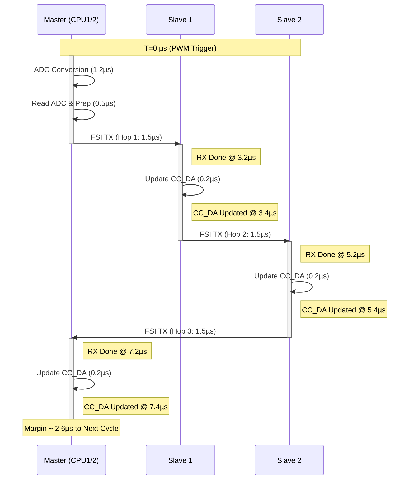
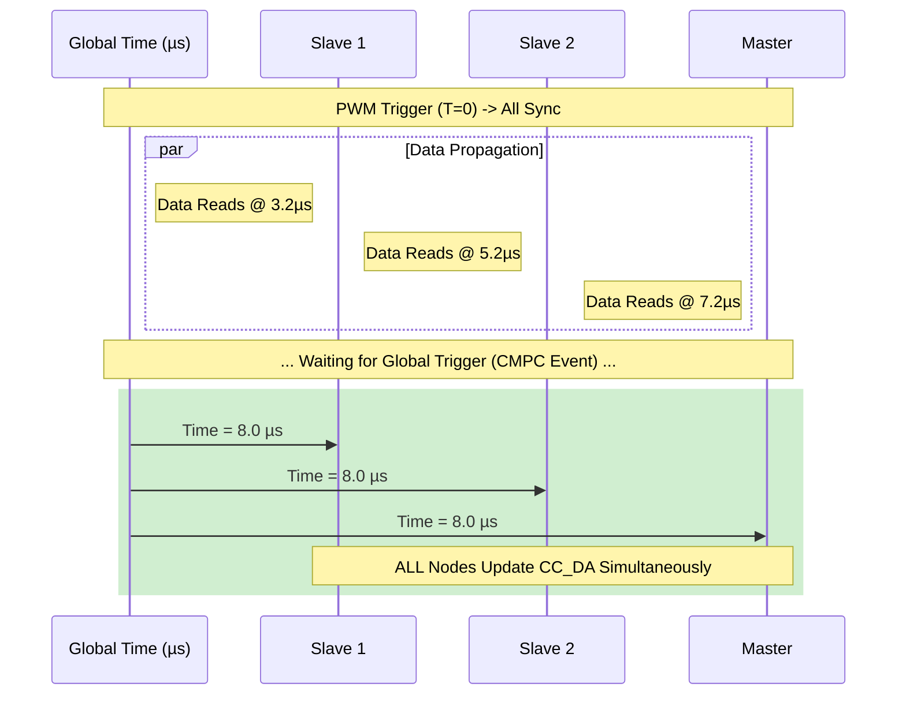

# R02_3_PARALLEL_LOOP

# R02_3 - FSI 平行迴路時序分析 (Parallel Loop Timing Analysis)

本文件針對 **Master (ADC -> FSI) -> Slave 1 -> Slave 2 -> Master** 的特定平行迴路進行時序分析與估算。

## 1. 迴路定義 (Loop Definition)

根據需求描述，控制迴路流程如下：

1. **Master**: PWM 觸發 ADC 轉換 -> 等待 EOC -> 讀取 `CV_AD` -> 啟動 **FSI TX** (傳送至 Slave 1)。
2. **Slave 1**: 接收 **FSI RX** -> 更新 `CC_DA` -> 讀取 `S1_CV_AD` (假設已備妥) -> 啟動 **FSI TX** (傳送至 Slave 2)。
3. **Slave 2**: 接收 **FSI RX** -> 更新 `CC_DA` -> 讀取 `S2_CV_AD` (假設已備妥) -> 啟動 **FSI TX** (傳送至 Master)。
4. **Master**: 接收 **FSI RX** -> 更新 `CC_DA`。

此流程為 **序列式接力 (Daisy Chain)**，但各節點的 ADC 可能在 T=0 同步觸發，因此資料準備與傳輸可視為流水線操作。

---

## 2. 參數假設 (Assumptions & Parameters)

基礎參數源自 `D01` 與 `R02_1` 文件：

- **PWM 週期**: 10 µs (100 kHz)。
- **ADC 轉換時間 (Master LTC2353)**: > 1.1 µs (設定估計值 **1.2 µs**)。
- **ADC 讀取時間 (Master SPIC)**: 假設 SPI 50MHz, 16-bit + Overhead ≈ **0.5 µs**。
- **FSI 傳輸時間 (Wire Time)**:
    - Payload: 14 Words (284 bits 包含 Overhead)。
    - Rate: 200 Mbps (50 MHz DDR, 2 Lanes)。
    - 計算: 284 bits * 5ns = 1.42 µs (加上硬體延遲估計為 **1.5 µs**)。
- **節點處理延遲 (Node Processing)**:
    - RX 中斷/DMA 響應 + 暫存器寫入 (Updating CC_DA) + TX 啟動準備。
    - 估計值: **0.5 µs** (基於 C28x 高速 ISR/DMA 性能)。

---

## 3. 時序估算詳細列表 (Timing Estimation Breakdown)

以 PWM 觸發點為時間零點 (**T = 0 µs**)。

| 步驟 (Step) | 動作描述 (Description) | 耗時估算 (Duration) | 累積時間點 (Timestamp) | 備註 (Notes) |
| --- | --- | --- | --- | --- |
| **1** | **Master PWM Trigger** | - | **0.00 µs** | 全系統同步觸發 |
| **2** | Master ADC Conversion | 1.20 µs | **1.20 µs** | 等待 EOC |
| **3** | Master Read ADC & Prep FSI | 0.50 µs | **1.70 µs** | 讀取 SPI, 填入 FSI TX Buffer |
| **4** | **Master FSI TX Start** | - | **1.70 µs** | 開始發送 |
| **5** | Hop 1 Transmission (M->S1) | 1.50 µs | **3.20 µs** | 線路傳輸 + RX Latency |
| **6** | **Slave 1 RX Done** | - | **3.20 µs** | S1 收到完整封包 |
| **7** | **Slave 1 Update CC_DA** | 0.20 µs | **3.40 µs** | **[關鍵時間點 1]** |
| **8** | Slave 1 Prep & TX Start | 0.30 µs | 3.70 µs | 準備 S1 資料, 啟動 TX |
| **9** | Hop 2 Transmission (S1->S2) | 1.50 µs | **5.20 µs** | 線路傳輸 + RX Latency |
| **10** | **Slave 2 RX Done** | - | **5.20 µs** | S2 收到完整封包 |
| **11** | **Slave 2 Update CC_DA** | 0.20 µs | **5.40 µs** | **[關鍵時間點 2]** |
| **12** | Slave 2 Prep & TX Start | 0.30 µs | 5.70 µs | 準備 S2 資料, 啟動 TX |
| **13** | Hop 3 Transmission (S2->M) | 1.50 µs | **7.20 µs** | 線路傳輸 + RX Latency |
| **14** | **Master RX Done** | - | **7.20 µs** | Master 收到完整回授 |
| **15** | **Master Update CC_DA** | 0.20 µs | **7.40 µs** | **[關鍵時間點 3]** |

---

## 4. CC_DA 更新時間點總結 (CC_DA Update Summary)

在一個 10 µs 的 PWM 週期內，各節點完成 `CC_DA` 輸出的預估時間點如下：

1. **Slave 1 CC_DA Update**: **T = 3.40 µs**
2. **Slave 2 CC_DA Update**: **T = 5.40 µs**
3. **Master CC_DA Update**: **T = 7.40 µs**
- **安全餘裕 (Margin)**: 最後一個節點 (Master) 完成更新後，距離下一個週期 (10 µs) 尚有約 **2.6 µs** 的餘裕，符合 100kHz 即時控制需求。

---

## 5. 時序圖 (Timing Diagram)

---

## 6. 同步輸出策略 (Synchronized Output Strategy)

針對「全系統 CC_DA 同時輸出」之需求，利用 **PWM SYNC** 機制確保所有節點的時間基底 (Time Base) 同步，可採用 **延遲觸發 (Delayed Trigger)** 方式達成。

### 6.1 策略原理

1. **時間同步**: Master 與 Slaves 透過 RJ45 的 `PWM SYNC` 信號同步，確保所有節點的 T=0 (PWM Period Start) 是一致的。
2. **最晚到達時間 (Worst-Case Latency)**: 根據上述分析，資料到達最後一個節點 (Master) 的時間為 **T = 7.20 µs**。
3. **統一更新點 (Global Update Point)**: 設定一個晚於 7.20 µs 的統一時間點 (例如 **T = 8.00 µs**)，所有節點在此時刻才真正更新 Hardware Output。

### 6.2 實作方式 (Implementation)

- **軟體機制**:
    - FSI RX ISR 僅負責接收資料並寫入暫存變數 (Buffer)，**不**立即寫入 MCBSP DXR。
    - **新增中斷 (Additional Interrupt)**: 所有的 Master 與 Slaves 都需啟用 **EPWM CMPC** (或 CMPB) 中斷。
- **硬體觸發**: 設定 **CMPC = 800 (8.00 µs)**。
- **ISR 動作 (CMPC ISR)**:
    - 當 CMPC 事件觸發 ISR 時，執行 `McBSP_DXR = New_CC_DA`。
    - 此時硬體隨即推動 SPI 信號更新 AD5543，實現全系統同步輸出。

### 6.3 同步時序表 (Synchronized Timing Table)

設定統一觸發點為 **T = 8.00 µs**。

| 節點 (Node) | 資料備妥時間 (Data Ready) | 等待時間 (Wait) | 統一觸發時間 (Global Update) | 狀態 |
| --- | --- | --- | --- | --- |
| **Slave 1** | 3.20 µs | 4.80 µs | **8.00 µs** | 等待最久，輸出同步 |
| **Slave 2** | 5.20 µs | 2.80 µs | **8.00 µs** | 輸出同步 |
| **Master** | 7.20 µs | 0.80 µs | **8.00 µs** | 剛好趕上，輸出同步 |

### 6.4 同步時序圖 (Synchronized Diagram)

### 6.5 結論

可以達成同時輸出。除了原有的 PWM EOC 中斷外，**確實需要新增一個 CMPC (CMP800) 中斷** 來作為統一的觸發點。建議將統一更新點設為 **8.0 µs** (保留約 0.8 µs 的緩衝與 Jitter 容許空間)，既能保證數據完整，又能在當前週期 (Current Cycle) 內完成控制。