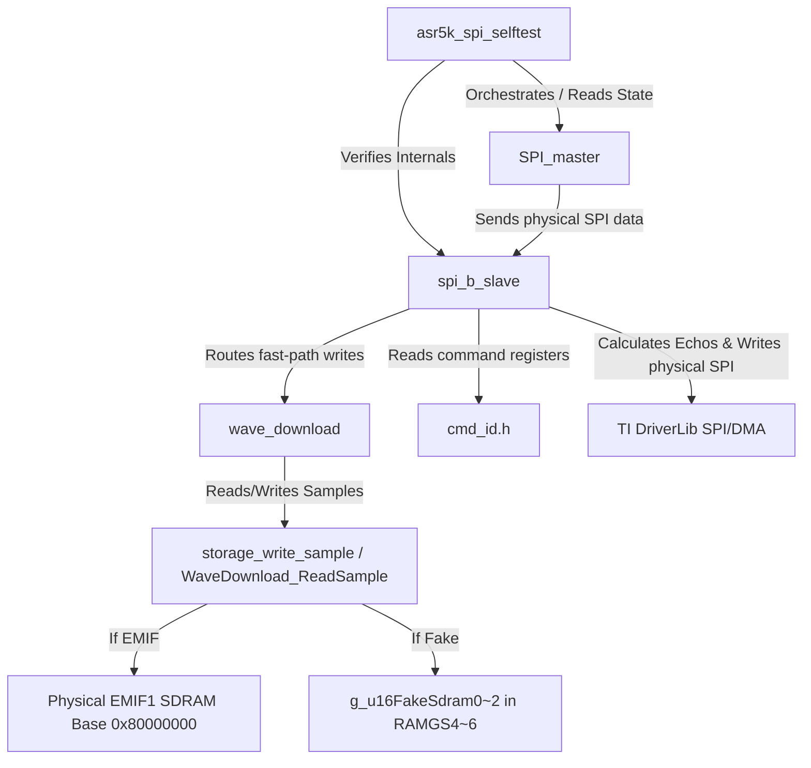

# M5R_PORTABILITY_REVIEW

Version: 1.0  
Type: Tier 3 (Milestone Review Log & Portability Assessment)  
Maintainer: Antigravity AI  

---

## 1. Module Inventory

This section lists the modules completed between Milestones 1 and 5A, detailing their source files, responsibilities, and use of TI DriverLib or physical register calls.

1.  **SPI Master Emulator (SPIA)**:
    *   *Files*: [SPI_master.c](file:///c:/Users/roger_lin/Documents/GitHub/ASR5K_GITLAB_GW/ASR5K_V2_Function/WP_3352_SPI/Emu_3352_SPI/SPIA_Master/SPI_master.c), [SPI_master.h](file:///c:/Users/roger_lin/Documents/GitHub/ASR5K_GITLAB_GW/ASR5K_V2_Function/WP_3352_SPI/Emu_3352_SPI/SPIA_Master/SPI_master.h)
    *   *Responsibility*: Emulates host processor (AM3352) behavior by queueing single register writes/reads, executing stress tests (1000 frames), and performing 4095-sample block downloads (Test 9) to verify communication integrity.
    *   *Coupling*: Uses direct C2000 DriverLib calls (e.g. `SPI_writeDataNonBlocking`, `SPI_readDataNonBlocking`, `SPI_getInterruptStatus`) mapped to `SPIA_BASE`.
2.  **SPIB Slave DMA RX/TX Driver**:
    *   *Files*: [spi_b_slave.c](file:///c:/Users/roger_lin/Documents/GitHub/ASR5K_GITLAB_GW/ASR5K_V2_Function/WP_3352_SPI/Emu_3352_SPI/SPIB_Slave/spi_b_slave.c), [spi_slave.h](file:///c:/Users/roger_lin/Documents/GitHub/ASR5K_GITLAB_GW/ASR5K_V2_Function/WP_3352_SPI/Emu_3352_SPI/SPIB_Slave/spi_slave.h)
    *   *Responsibility*: Configures SPIB, initializes and manages DMA Channel 3 (RX) and Channel 4 (TX) to handle 2-word packets, handles overrun/underflow errors, alternates Ping/Pong RX buffers on DMA completion, and runs the main FSM.
    *   *Coupling*: Heavily coupled to physical SPIB and DMA registers via C2000 DriverLib.
3.  **Legacy Register Parser**:
    *   *Files*: Embedded inside [spi_b_slave.c](file:///c:/Users/roger_lin/Documents/GitHub/ASR5K_GITLAB_GW/ASR5K_V2_Function/WP_3352_SPI/Emu_3352_SPI/SPIB_Slave/spi_b_slave.c) (functions `tryHandleFastPath`, `tryHandleBlockPath`, `SPIB_ParseLegacyRegFrame`, `feedPacketWord`).
    *   *Responsibility*: Decodes 2-word frames, routes register writes (fast-path vs. block-path), manages the legacy block receiver FSM (checksum check, sequence checks), and calculates checksums for replies.
    *   *Coupling*: Directly calls physical SPI write function `writeDirectSpiResponse` which issues DriverLib writes (`SPI_writeDataNonBlocking`) to `SPIB_SYSTEM_BASE`.
4.  **Command ID Map**:
    *   *Files*: Duplicate headers [cmd_id.h](file:///c:/Users/roger_lin/Documents/GitHub/ASR5K_GITLAB_GW/ASR5K_V2_Function/WP_3352_SPI/Emu_3352_SPI/SPIB_Slave/cmd_id.h) and [cmd_id.h](file:///c:/Users/roger_lin/Documents/GitHub/ASR5K_GITLAB_GW/ASR5K_V2_Function/WP_3352_SPI/Emu_3352_SPI/SPIA_Master/cmd_id.h)
    *   *Responsibility*: Centralized definition of D11 legacy command register addresses (e.g. `WAVE_PAGE_SELECT_ADDR = 0x0958`, `WAVE_VALIDATE_ADDR = 0x0960`, `WAVE_ACTIVATE_ADDR = 0x0961`).
    *   *Coupling*: Purely macros (no physical coupling), but duplicated across folders.
5.  **Wave Download Service**:
    *   *Files*: [wave_download.c](file:///c:/Users/roger_lin/Documents/GitHub/ASR5K_GITLAB_GW/ASR5K_V2_Function/WP_3352_SPI/Emu_3352_SPI/SPIB_Slave/wave_download.c), [wave_download.h](file:///c:/Users/roger_lin/Documents/GitHub/ASR5K_GITLAB_GW/ASR5K_V2_Function/WP_3352_SPI/Emu_3352_SPI/SPIB_Slave/wave_download.h)
    *   *Responsibility*: Implements the download state machine (EMPTY, DOWNLOADING, COMPLETE, VALIDATING, VALID, LOCKED), validates selected page range, sample count (4096), last address (`0x3FFF`), continuity, and output-off status.
    *   *Coupling*: Logic is platform-independent, but includes C2000 compiler `#pragma DATA_SECTION` annotations and references `spi_slave.h` (for `OUTPUT_ON`).
6.  **Fake Storage / Future EMIF SDRAM Backend**:
    *   *Files*: Integrated within [wave_download.c](file:///c:/Users/roger_lin/Documents/GitHub/ASR5K_GITLAB_GW/ASR5K_V2_Function/WP_3352_SPI/Emu_3352_SPI/SPIB_Slave/wave_download.c) (functions `storage_write_sample` and `WaveDownload_ReadSample`).
    *   *Responsibility*: Emulates RAM pages (`g_u16FakeSdram0`~`2` in `RAMGS4~6`) when `ASR5K_HAS_EMIF1_SDRAM` is undefined; writes directly to F28388D EMIF1 SDRAM space (`0x80000000 + page_id * 8192`) when defined.
    *   *Coupling*: Uses a compile-time switch directly inside the service file, containing hard-coded C2000 memory section pragmas.
7.  **Selftest Framework**:
    *   *Files*: [asr5k_spi_selftest.c](file:///c:/Users/roger_lin/Documents/GitHub/ASR5K_GITLAB_GW/ASR5K_V2_Function/WP_3352_SPI/Emu_3352_SPI/asr5k_spi_selftest.c), [asr5k_spi_selftest.h](file:///c:/Users/roger_lin/Documents/GitHub/ASR5K_GITLAB_GW/ASR5K_V2_Function/WP_3352_SPI/Emu_3352_SPI/asr5k_spi_selftest.h)
    *   *Responsibility*: Runs 9 diagnostic test cases, coordinating the Master Emulator and verifying Slave driver states, frame counters, and download page validation.
    *   *Coupling*: Directly accesses low-level global structs (`spiB_slave`, `g_waveDownload`) and modifies internal states for testing.
8.  **Linker & Board Config Coupling**:
    *   *Files*: [spib_block_ram.cmd](file:///c:/Users/roger_lin/Documents/GitHub/ASR5K_GITLAB_GW/ASR5K_V2_Function/WP_3352_SPI/Emu_3352_SPI/spib_block_ram.cmd), [main.syscfg](file:///c:/Users/roger_lin/Documents/GitHub/ASR5K_GITLAB_GW/ASR5K_V2_Function/WP_3352_SPI/Emu_3352_SPI/main.syscfg)
    *   *Responsibility*: Maps driver state variables, fake storage pages, and buffers to C2000 GS RAM blocks (`RAMGS0`~`6`); configures physical SPIA/SPIB pins and clocks.

---

## 2. Dependency Direction

This section maps the structural dependencies between components.



### Dependency Audit & Violations:
*   **Protocol Layer $\rightarrow$ Hardware (Violation)**: The legacy parser (`tryHandleFastPath` / `tryHandleBlockPath`) is embedded inside [spi_b_slave.c](file:///c:/Users/roger_lin/Documents/GitHub/ASR5K_GITLAB_GW/ASR5K_V2_Function/WP_3352_SPI/Emu_3352_SPI/SPIB_Slave/spi_b_slave.c) and directly invokes physical transmit function `writeDirectSpiResponse` which calls C2000 DriverLib code (`SPI_writeDataNonBlocking`). *The protocol layer must not touch hardware.*
*   **Service Layer $\rightarrow$ Driver (Violation)**: The Wave Download Service depends on [spi_slave.h](file:///c:/Users/roger_lin/Documents/GitHub/ASR5K_GITLAB_GW/ASR5K_V2_Function/WP_3352_SPI/Emu_3352_SPI/SPIB_Slave/spi_slave.h) to access the global flag `OUTPUT_ON`. *The service layer must not know SPI/DMA details.*
*   **Storage Backend Separation (Violation)**: The storage write/read logic is embedded inside [wave_download.c](file:///c:/Users/roger_lin/Documents/GitHub/ASR5K_GITLAB_GW/ASR5K_V2_Function/WP_3352_SPI/Emu_3352_SPI/SPIB_Slave/wave_download.c) using `#ifdef` conditional compiling instead of separating fake RAM and EMIF1 SDRAM into their own clean drivers behind a storage interface.
*   **Test Code Leakage (Violation)**: Mock FSM code like `handleBackgroundFlashCommit` (used to simulate flash write latency for the block RAM test path) resides directly inside the production driver file [spi_b_slave.c](file:///c:/Users/roger_lin/Documents/GitHub/ASR5K_GITLAB_GW/ASR5K_V2_Function/WP_3352_SPI/Emu_3352_SPI/SPIB_Slave/spi_b_slave.c). Also, diagnostic variables like `u32FastPathCount` are part of the production driver structures.

---

## 3. Board-Specific Coupling

Hardware-specific features and bindings that couple the codebase to the TI F28388D:

1.  **DriverLib Configuration Bases**:
    *   `SPIB_SYSTEM_BASE` $\rightarrow$ bound to `SPIB_BASE` register space.
    *   `SPIB_RX_DMA_CH_BASE` $\rightarrow$ bound to `DMA_CH3_BASE`.
    *   `DMA_CH4_BASE` $\rightarrow$ hard-coded for transmit.
2.  **Pinmux and Clock Tree Settings**:
    *   GPIO63, GPIO64, GPIO65, and GPIO66 configured as SPIB peripheral pins.
    *   LOSPCP (Low-Speed Peripheral Clock Prescaler) configured to 1 to drive the SPI baud rate at 12.5 MHz.
3.  **Compiler Memory Section Directives**:
    *   Hard-coded compiler annotations (`#pragma DATA_SECTION`) route states and buffers (e.g. `spib_slave_state`, `fake_sdram_page0`~`2`) to specific sections in the C files.
4.  **Linker Memory Segments**:
    *   [spib_block_ram.cmd](file:///c:/Users/roger_lin/Documents/GitHub/ASR5K_GITLAB_GW/ASR5K_V2_Function/WP_3352_SPI/Emu_3352_SPI/spib_block_ram.cmd) couples sections directly to physical F28388D RAM blocks: `RAMGS0` (Master wave), `RAMGS2` (Block RAM), `RAMGS3` (Slave state), `RAMGS4~6` (Fake SDRAM pages).

---

## 4. Hard-coded Resource List

List of system resources currently hard-coded inside the code files:

*   **SPI Base Addresses**: `SPIA_BASE` (in [SPI_master.c](file:///c:/Users/roger_lin/Documents/GitHub/ASR5K_GITLAB_GW/ASR5K_V2_Function/WP_3352_SPI/Emu_3352_SPI/SPIA_Master/SPI_master.c)) and `SPIB_BASE` (in [spi_slave.h](file:///c:/Users/roger_lin/Documents/GitHub/ASR5K_GITLAB_GW/ASR5K_V2_Function/WP_3352_SPI/Emu_3352_SPI/SPIB_Slave/spi_slave.h)).
*   **DMA Channels**: Channel 3 (`DMA_CH3_BASE` RX) and Channel 4 (`DMA_CH4_BASE` TX) in [spi_slave.h](file:///c:/Users/roger_lin/Documents/GitHub/ASR5K_GITLAB_GW/ASR5K_V2_Function/WP_3352_SPI/Emu_3352_SPI/SPIB_Slave/spi_slave.h).
*   **DMA Trigger Source**: `DMA_TRIGGER_SPIBRX` in [spi_b_slave.c](file:///c:/Users/roger_lin/Documents/GitHub/ASR5K_GITLAB_GW/ASR5K_V2_Function/WP_3352_SPI/Emu_3352_SPI/SPIB_Slave/spi_b_slave.c).
*   **Linker Section Mappings**: Pragmas referencing `spib_slave_state`, `spib_block_ram`, `fake_sdram_page0`~`2` in C files.
*   **Fake RAM Allocations**: Hard-coded 3 pages (`g_u16FakeSdram0`~`2` with size 4096) in [wave_download.c](file:///c:/Users/roger_lin/Documents/GitHub/ASR5K_GITLAB_GW/ASR5K_V2_Function/WP_3352_SPI/Emu_3352_SPI/SPIB_Slave/wave_download.c).
*   **Timeout Thresholds**: `T_2MS` (2ms in timer ticks) used for DMA and frame timeout detection.

---

## 5. Reusable Modules

Modules that are platform-independent and can be compiled and reused on a different processor without modification:

*   **SPI FIFO Buffer** ([spi_fifo.c](file:///c:/Users/roger_lin/Documents/GitHub/ASR5K_GITLAB_GW/ASR5K_V2_Function/WP_3352_SPI/Emu_3352_SPI/SPIB_Slave/spi_fifo.c) / [spi_fifo.h](file:///c:/Users/roger_lin/Documents/GitHub/ASR5K_GITLAB_GW/ASR5K_V2_Function/WP_3352_SPI/Emu_3352_SPI/SPIB_Slave/spi_fifo.h)): Fully platform-independent, register-free software circular queue.
*   **SPI Ping-Pong Buffer** ([spi_pingpong.c](file:///c:/Users/roger_lin/Documents/GitHub/ASR5K_GITLAB_GW/ASR5K_V2_Function/WP_3352_SPI/Emu_3352_SPI/SPIB_Slave/spi_pingpong.c) / [spi_pingpong.h](file:///c:/Users/roger_lin/Documents/GitHub/ASR5K_GITLAB_GW/ASR5K_V2_Function/WP_3352_SPI/Emu_3352_SPI/SPIB_Slave/spi_pingpong.h)): Pure logic managing buffer states, write pointers, and overrun checks.
*   **Wave Download FSM** ([wave_download.c](file:///c:/Users/roger_lin/Documents/GitHub/ASR5K_GITLAB_GW/ASR5K_V2_Function/WP_3352_SPI/Emu_3352_SPI/SPIB_Slave/wave_download.c) / [wave_download.h](file:///c:/Users/roger_lin/Documents/GitHub/ASR5K_GITLAB_GW/ASR5K_V2_Function/WP_3352_SPI/Emu_3352_SPI/SPIB_Slave/wave_download.h)): The state transition logic, sample counting, and validation criteria are independent of hardware (once the `#pragma DATA_SECTION` lines are abstracted).

---

## 6. Non-reusable Modules

Modules containing hard-coded DriverLib or F28388D architecture requirements that must be modified or rewritten for a different platform:

*   **SPI Slave Driver** ([spi_b_slave.c](file:///c:/Users/roger_lin/Documents/GitHub/ASR5K_GITLAB_GW/ASR5K_V2_Function/WP_3352_SPI/Emu_3352_SPI/SPIB_Slave/spi_b_slave.c)): Contains direct DriverLib configuration of SPIB, FIFOs, and DMA.
*   **SPI Master Emulator** ([SPI_master.c](file:///c:/Users/roger_lin/Documents/GitHub/ASR5K_GITLAB_GW/ASR5K_V2_Function/WP_3352_SPI/Emu_3352_SPI/SPIA_Master/SPI_master.c)): Direct register writes to SPIA base and FIFO controls.
*   **Linker Script** ([spib_block_ram.cmd](file:///c:/Users/roger_lin/Documents/GitHub/ASR5K_GITLAB_GW/ASR5K_V2_Function/WP_3352_SPI/Emu_3352_SPI/spib_block_ram.cmd)): Entirely bound to F28388D GS RAM naming.

---

## 7. Required Refactor Before M5B

To enable a clean integration with the CPU2 DDS state machine in Milestone 5B:

1.  **Extract Legacy Parser**:
    *   Pull out `tryHandleFastPath`, `tryHandleBlockPath`, `SPIB_ParseLegacyRegFrame`, and `feedPacketWord` from [spi_b_slave.c](file:///c:/Users/roger_lin/Documents/GitHub/ASR5K_GITLAB_GW/ASR5K_V2_Function/WP_3352_SPI/Emu_3352_SPI/SPIB_Slave/spi_b_slave.c) into a new file `legacy_reg_protocol.c`.
    *   Expose a clean interface: the driver receives raw 16-bit words, passes them to the parser, and the parser returns a status or response frame. Move `writeDirectSpiResponse` out of the parser logic so that it does not call DriverLib.
2.  **Centralize Command IDs**:
    *   Merge [cmd_id.h](file:///c:/Users/roger_lin/Documents/GitHub/ASR5K_GITLAB_GW/ASR5K_V2_Function/WP_3352_SPI/Emu_3352_SPI/SPIB_Slave/cmd_id.h) and [cmd_id.h](file:///c:/Users/roger_lin/Documents/GitHub/ASR5K_GITLAB_GW/ASR5K_V2_Function/WP_3352_SPI/Emu_3352_SPI/SPIA_Master/cmd_id.h) into a single, shared header file located in a central folder (e.g. `common/`).
3.  **Isolate Test Mock Code**:
    *   Remove `handleBackgroundFlashCommit` from the production driver file [spi_b_slave.c](file:///c:/Users/roger_lin/Documents/GitHub/ASR5K_GITLAB_GW/ASR5K_V2_Function/WP_3352_SPI/Emu_3352_SPI/SPIB_Slave/spi_b_slave.c) and move it into a mock test file or wrap it under `#ifdef DIAG_SELFTEST` compile guards.

---

## 8. Optional Refactor Later

1.  **Hardware Abstraction Layer (HAL)**:
    *   Abstract SPI transmit/receive and DMA arming behind a generic interface (e.g. `hal_spi.h` / `hal_dma.h`) so that migrating from SPIB to a different peripheral or microcontroller requires only a new HAL driver implementation.
2.  **Separate Storage Drivers**:
    *   Create a formal `storage_interface.h` providing `storage_write_sample` and `storage_read_sample` interfaces.
    *   Implement EMIF1 SDRAM write/read in `emif1_sdram.c` and fake storage in `fake_storage.c`, compiling and linking the appropriate backend based on build configuration.
3.  **Portable Memory Placement**:
    *   Define compiler-portable macros (e.g. `PLACE_IN_SECTION("name")`) in a HAL header to avoid scattering TI-specific `#pragma DATA_SECTION` directives inside core service files.

---

## 9. Recommended Folder Structure

Reorganize the project to separate application, protocol, service, driver, HAL, and test code:

```text
ASR5K-Lite/
├── common/                       <-- Shared constants & generic utilities
│   ├── cmd_id.h                  <-- CENTRALIZED Command IDs
│   └── ctypedef.h
├── protocol/                     <-- Pure communication parsing (no hardware calls)
│   ├── legacy_reg_protocol.c     <-- DECOUPLED Legacy Parser
│   └── legacy_reg_protocol.h
├── services/                     <-- High-level service state machines
│   ├── wave_download_service.c   <-- DECOUPLED Wave Download FSM
│   └── wave_download_service.h
├── drivers/                      <-- Physical hardware drivers (TI DriverLib dependent)
│   ├── spi_slave_driver.c        <-- Pure C2000 SPIB Slave Driver
│   ├── spi_slave_driver.h
│   ├── emif1_sdram.c             <-- Physical SDRAM storage driver
│   └── emif1_sdram.h
├── hal/                          <-- Interfaces and board parameters
│   ├── board_config.h            <-- Board peripheral bases/DMA channel configs
│   └── storage_interface.h       <-- Storage write/read declarations
├── test/                         <-- Test code and diagnostic frameworks
│   ├── spi_master_emu.c          <-- SPI Master Emulator
│   ├── spi_master_emu.h
│   ├── fake_storage.c            <-- Fake storage backend (DIAG-only)
│   ├── asr5k_spi_selftest.c      <-- Test Harness
│   └── asr5k_spi_selftest.h
└── cmd/                          <-- Linker scripts
    └── spib_block_ram.cmd
```

---

## 10. Final Verdict

### **PARTIALLY PORTABLE**

**Reasoning**: High-level modules like the **Wave Download Service** and **Command Map** are logically portable. However, the **Legacy Parser** is heavily coupled with the SPIB DriverLib calls, and hardware configuration resources (SPI base, DMA channels) are hard-coded in the headers instead of a clean HAL.

---

## Portability Questions & Answers

### Q: Can M5A modules be reused on a future board by changing only HAL/board_config/linker config?

**Answer**: **NO.**

### Blockers:
1.  **Parser-to-Hardware Coupling**:
    *   The legacy register parser is directly embedded inside [spi_b_slave.c](file:///c:/Users/roger_lin/Documents/GitHub/ASR5K_GITLAB_GW/ASR5K_V2_Function/WP_3352_SPI/Emu_3352_SPI/SPIB_Slave/spi_b_slave.c#L428) and directly calls C2000 DriverLib function `SPI_writeDataNonBlocking` through `writeDirectSpiResponse`. Reusing the parser on a future board would require editing parser source code to remove physical SPI register dependencies.
2.  **Compile-Time Storage Selection in Service Layer**:
    *   [wave_download.c](file:///c:/Users/roger_lin/Documents/GitHub/ASR5K_GITLAB_GW/ASR5K_V2_Function/WP_3352_SPI/Emu_3352_SPI/SPIB_Slave/wave_download.c#L69-L98) contains internal `#ifdef ASR5K_HAS_EMIF1_SDRAM` compile guards and declares the fake local RAM buffers (`g_u16FakeSdram0`~`2`) inside the service file itself. Changing the storage backend requires modifying the Wave Download Service source code directly.
3.  **In-Source Compiler Memory Sections**:
    *   Data structures (e.g. `g_waveDownload` and `g_u16FakeSdram0`~`2`) are decorated with TI-specific `#pragma DATA_SECTION` lines directly inside the source files. Compiling on a different board/compiler (e.g. GCC) requires direct edits to clean these compiler-specific lines.
4.  **Duplicated Command Map Configuration**:
    *   The command address registry `cmd_id.h` is duplicated between the master and slave folders instead of being centrally referenced, leading to divergence risks on a new board design.
5.  **Test Mock Code Leaked into Production Driver**:
    *   The mock flash commit simulation FSM (`handleBackgroundFlashCommit`) is built directly into [spi_b_slave.c](file:///c:/Users/roger_lin/Documents/GitHub/ASR5K_GITLAB_GW/ASR5K_V2_Function/WP_3352_SPI/Emu_3352_SPI/SPIB_Slave/spi_b_slave.c#L731-L778).
