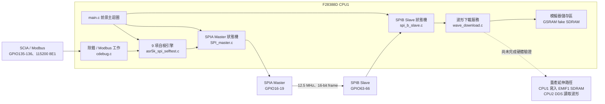
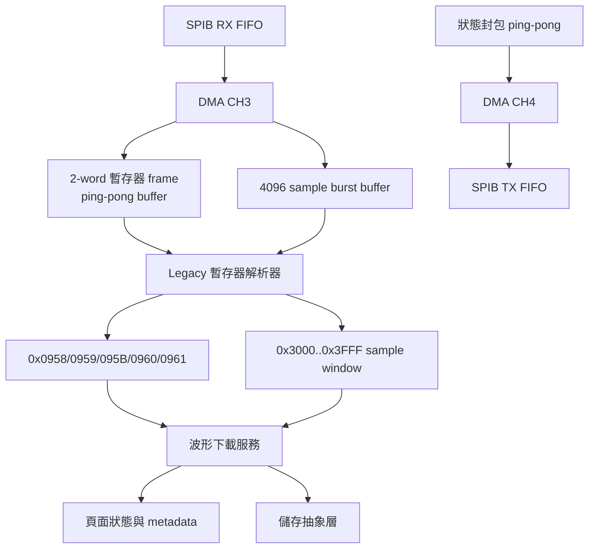

# ASR5K SPI 模組架構

狀態：`REFERENCE_ONLY`  
更新日期：2026-06-15

本圖是目前模擬器的實作導覽，不會覆寫已凍結的架構決策或受控規格。

## 執行架構



## SPI 接收與波形路徑



## 模組職責

| 模組 | 職責 |
|---|---|
| `main.c` | 執行 slave、master 與非阻塞式自檢服務。 |
| `SPIA_Master/SPI_master.c` | 排程暫存器交易、block 傳輸、wave burst 產生、timeout 與 master 診斷。 |
| `SPIB_Slave/spi_b_slave.c` | 負責 DMA CH3 接收路徑、Legacy parser、burst mode 切換、DMA CH4 狀態傳送，以及 protocol/service 診斷。 |
| `SPIB_Slave/wave_download.c` | 負責頁面選擇、sample 寫入、metadata、驗證、啟用、鎖定頁面與 Output ON 保護。 |
| `asr5k_spi_selftest.c` | 執行 Test1 至 Test9，驗證 master 結果、counter、fault、metadata 與全部 4096 筆 sample。 |
| `debug_app/cdebug.c` | 管理 SCIA 設定，並讓 Modbus 與 `spi_test all` 命令共用 UART。 |
| `flashapi/table_manager` | PC 端 Python Modbus/table 工具，與 SPI 自檢傳輸路徑彼此獨立。 |

## 已驗證的通訊協定順序

```text
0x0958 = page_id
0x095B = 4096
2 x guard frame
0x3000..0x3FFF = 4096 samples
1 x trailing flush frame
0x0959 = 1
0x0960 = 1
0x0961 = 1
```

目前驗證結果：page 1 可到達 `LOCKED=6`，4096 筆 sample 位址連續，且
SPIA/SPIB fault 皆為 0。量產 EMIF1 儲存整合與 D10 checksum 完整驗證仍是
獨立的後續工作。
