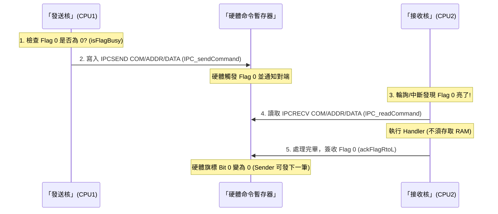
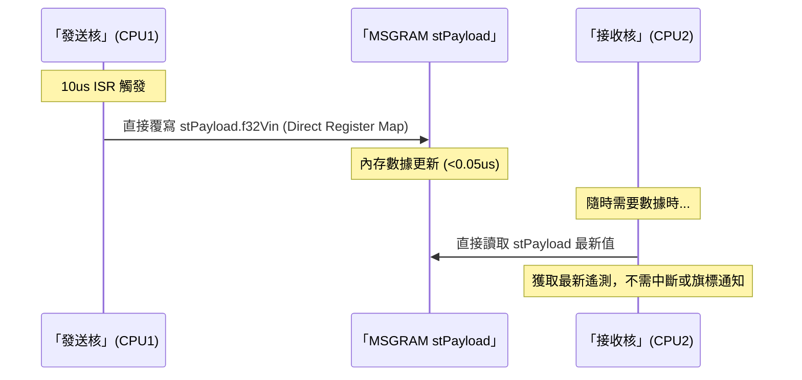

# IPC 通訊硬體流轉與邏輯詳解 (Hardware Flow Detail)
---

## 1. 核心組件 (Physical Components)

*   **IPC Command Registers (實體命令暫存器)**：
    *   **定義**：專用的 32-bit 硬體暫存器 (`IPCSENDCOM`, `ADDR`, `DATA`)。
    *   **特性**：**物理上繞過 RAM**，直接透過內部外設匯流排傳輸，速度最快且不佔用記憶體。
*   **Message RAM (專用共享記憶體)**：
    *   **定義**：位於 `0x3A000` (CPU1->2) 或 `0x3B000` (CPU2->1) 的 2KB SRAM。
    *   **特性**：用於存放持續更新的數據流 (B 類)，不需旗標通知。
*   **IPC Flag (旗標/門鈴)**：
    *   **功能**：點亮 Flag 位元使對端產生中斷或狀態變化。
*   **IPC Register (暫存器控制)**：
    *   `IPCSET` / `IPCCLR` / `IPCACK`：主動點火、清除或簽收旗標。

---

## 2. A 類模式：指令信箱流程 (Instruction Mailbox Flow)
用於發送指令（如 `IPC_CMD_SET`）。**利用硬體暫存器實現零內存開銷傳輸。**

---

## 3. B 類模式：大容量數據流流程 (Data Streaming)
用於 10us ISR 高頻遙測。**利用 Message RAM 實現即時共享。**

## 結論

*   **A 類 (Command)** 是「實體掛號信」，利用硬體暫存器直接對傳，確保指令抵達且不經 RAM 搬運。
*   **B 類 (Streaming)** 是「即時共享窗」，利用專用 RAM 區段展示數據，實現真正的數據層級解耦。
