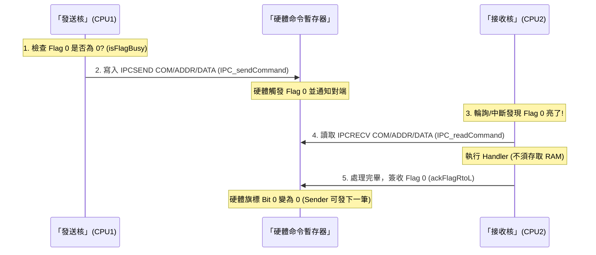
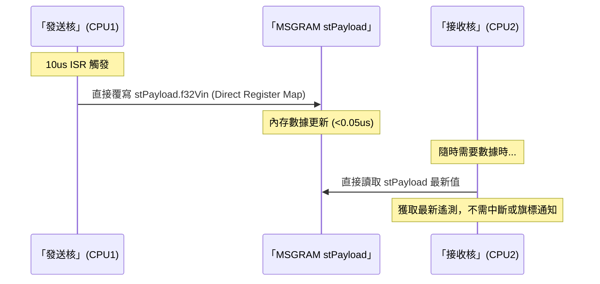

# IPC (Inter-Processor Communication) 綜合技術手冊

本手冊整合了 F28388x 雙核系統中 IPC 模組的架構設計、硬體同步機制、內存分配佈局及效能審計數據，為開發與維護提供單一事實來源 (Single Source of Truth)。

---

## 1. 系統架構 (System Architecture)

IPC 模組遵循「三層解耦」設計原則，確保代碼的高移植性與可維護性：

- **硬體抽象層 (HAL)**: 封裝 TI DriverLib `IPC_init`, `IPC_sync`, `IPC_setFlagLtoR` 等暫存器操作。
- **功能邏輯層 (Functional Layer)**: 實作循環緩衝區 (Circular Buffer)、狀態機 (FSM) 與指令分發器 (Dispatcher)。
- **應用服務層 (Service Layer)**: 定義具體的 `IPC_Command_t` 指令處理函式 (Handlers) 與共享記憶體數據結構。

---

## 2. 硬體資料傳輸與同步機制

系統將通訊分為四種硬體層次的同步機制：

### 2.1 IPC Flags & Interrupts (事件旗標)
*   **機制**：32-bit 的 `IPCSET`/`IPCCLR` (發送端) 與 `IPCSTS`/`IPCACK` (接收端) 暫存器。
*   **特性**：純硬體信號 (Event signaling)，不攜帶 Payload。
*   **場景**：Flag 0~3 用於觸發中斷，Flag 4~31 供輪詢使用。常用於 FSM 狀態切換通知、保護機制觸發。

### 2.2 IPC Command Registers (命令暫存器 - A 類模式)
*   **機制**：`IPCSENDCOM`, `ADDR`, `DATA` 等 32-bit 暫存器群。
*   **特性**：**物理上繞過 RAM**，直接透過內部外設匯流排傳輸，速度最快。
*   **場景**：適合高頻率的短指令傳輸（如：控制命令、特定變數 Pointer 拋轉）。

### 2.3 Message RAMs (專用共享記憶體 - B 類模式)
*   **機制**：兩塊獨立的 2KB 單埠 SRAM (CPU1->2: 0x3FC00, CPU2->1: 0x3F800)。
*   **特性**：大吞吐量傳輸。發送端具 R/W 權限，接收端僅具 R 權限，硬體鎖死衝突。
*   **場景**：高頻遙測數據流 (Streaming)、故障快照 (Snapshot)。

### 2.4 IPC Boot-Mode Registers (開機模式)
*   **場景**：由 `Device_init()` 階段使用，用於分配啟動資源與指定啟動入口，無需上層業務邏輯介入。

---

## 3. 通訊邏輯流 (Flow Logic)

### 3.1 A 類模式：指令信箱流程 (Instruction Mailbox)
用於發送指令，利用指令暫存器實現零內存開銷。



### 3.2 B 類模式：大容量數據流流程 (Data Streaming)
用於 10us ISR 高頻遙測，利用 Message RAM 實現即時共享。



---

## 4. 記憶體分配詳解 (Memory Layout)

### 4.1 控制平面：Message RAM (MSGRAM)
*   **A 類短指令**：已從 MSGRAM 中完全**移除**，改由純硬體暫存器傳輸。
*   **stPayload (B 類)**：實例化於各核發送區域（CPU1: 0x3A000, CPU2: 0x3B000）。包含 `f32Vin`, `f32Iout`, `u32Status` 等。

### 4.2 數據平面：全域共享 RAM (GSRAM)
用於傳遞大型數組或非即時性塊數據。CPU1 負責初始化權限：
```c
ALLOW_CPU2_ACCESS_GSRAM(MEMCFG_SECT_GS5 | MEMCFG_SECT_GS6 | MEMCFG_SECT_GS7 | 
                        MEMCFG_SECT_GS8 | MEMCFG_SECT_GS9 | MEMCFG_SECT_GS10 | 
                        MEMCFG_SECT_GS11 | MEMCFG_SECT_GS15);
```
*   **GS5 ~ GS11 & GS15**: 開放 CPU2 讀寫權限。
*   **GS12 ~ GS14**: CPU1 獨佔私有區，存取將觸發硬體保護。

---

## 5. 狀態機與生命週期 (FSM)

系統管理四大核心狀態：
1.  **IDLE**: 待命狀態。
2.  **SYNC**: 開機 Barrier 同步階段 (使用 Flag 31)。
3.  **RUN**: 正常運作模式，具備心跳監控 (`u32TimestampHW`)。
4.  **ERR**: 故障模式。具備「首位故障凍結 (First-Failure-Freeze)」特性，自動執行 `stSnapshot` 數據快照。

---

## 6. 效能審計報告 (CPU @ 200MHz)

針對 100kHz (10us) 控制迴圈的實測開銷：

| 行為項目 | CPU Cycles | 耗時 (us) | 10us 佔用率 |
| :--- | :--- | :--- | :--- |
| **數據流直接寫入 (Direct Float)** | 6 ~ 8 | 0.035us | 0.35% |
| **指令入隊 (Queue Push)** | 18 ~ 22 | 0.11us | 1.1% |
| **中斷服務入口 (ISR Overhead)** | 120+ | 0.6us+ | 6.0% |
| **Dispatcher 查表分發** | 45 | 0.22us | 2.2% |

### 優化策略：
1.  **零除法策略**：控制路徑改用乘法倒數。
2.  **存取扁平化**：存取深度壓縮至 1 層，顯著減少 `LDR/STR` 指令。
3.  **無鎖設計**：使用非阻塞 Circular Buffer，避免關閉中斷產生的抖動。

---

## 7. 診斷與監控工具
*   **流量統計**: `u32Tx` / `u32Rx` (發送接收計數), `u32TxDrop` (佇列滿載丟包數)。
*   **錯誤快照**: 記錄 `u32ErrorCode`、故障時間戳與關鍵遙測數據備份。
