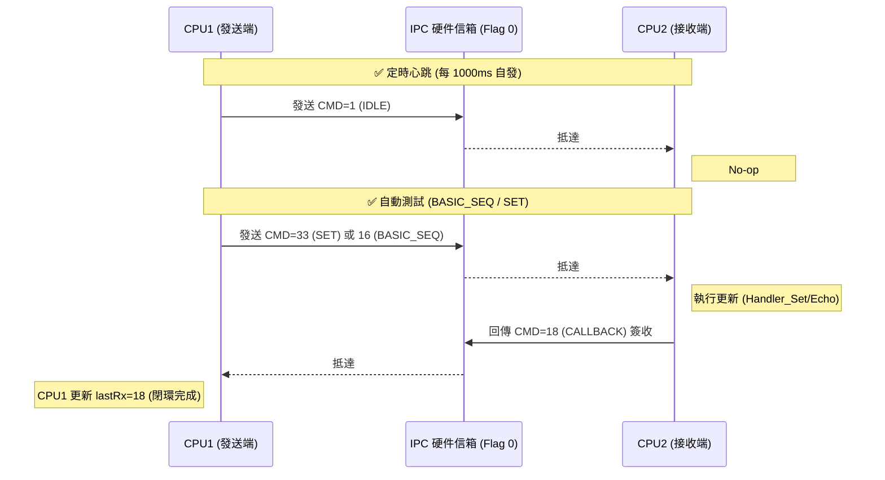

# IPC 模組驗證手冊 (Expert Manual - Fully Detailed)

本手冊指導您如何在 TI CCS 環境下，透過 Watch Window 進行深度的通訊驗證與壓力測試。

---

## 0. 指令交互流程圖 (Sequence Diagram)
本圖展示了 1 (IDLE), 18 (CALLBACK), 33 (SET/BASIC_SEQ) 的交互關係：

---

## 1. 環境準備 (Preparation)
請在 CCS 的 **Expressions (Watch Window)** 中加入：
1.  `IPC_ctl` (展開查看全域狀態)
2.  `IPC_ctl.eState` (監控狀態機：0:IDLE, 1:SYNC, 2:RUN)
3.  `IPC_ctl.eMode` (組合測試模式控制)
4.  `IPC_ctl.u32LastRx` (即時收信監控)

### 指令 ID 通解表 (Complete Command ID Map)
當您在 Watch Window 的 `u32LastTx/Rx` 看到以下**十進制**數值時，對應含義如下：

| 十進制 (Dec) | 十六進制 (Hex) | 指令名稱 (Command) | 說明 (Description) |
| :--- | :--- | :--- | :--- |
| **1** | 0x01 | `IPC_CMD_IDLE` | 心跳/閒置 (Heartbeat) |
| **5** | 0x05 | `IPC_CMD_STOP` | 緊急停機 (Shutdown) |
| **14** | 0x0E | `IPC_CMD_CLEAR_FAULT` | 故障復歸 (Clear Error) |
| **16** | 0x10 | `IPC_CMD_BASIC_SEQ` | 自動測試脈衝 (Test Pulse) |
| **17** | 0x11 | `IPC_CMD_GET` | 數據請求 (Fetch) |
| **18** | 0x12 | `IPC_CMD_CALLBACK` | 簽收回報 (Receipt/Ack) |
| **33** | 0x21 | `IPC_CMD_SET` | 變數注入 (Write/Inject) |
| **37** | 0x25 | `IPC_CMD_ENABLE_PWM` | 啟動 PWM 輸出 |
| **38** | 0x26 | `IPC_CMD_DISABLE_PWM` | 禁止 PWM 輸出 |

> [!TIP]
> **自動序列 (Mode 1)** 會在 **1 → 17 → 33 → 18** 之間循環。

---

## 1. 基礎同步測試 (Boot-Sync)
**目的**：確認 CPU1 與 CPU2 硬體連結與內存共享已建立。
1.  **觀察點**：`IPC_ctl.eState` 應在開機手動 Resume 後進入 `IPC_STATE_RUN` (2)。
2.  **暫存器**：同步完成後，`IpcRegs` 中的 Flag 0 與 Flag 31 應皆由硬體自動清零。
3.  **心跳驗證**：觀察 **`psRemoteShm->u32TimestampHW`**。該數值應規律遞增（每 10us-1ms 更新），證明對端核心運算正常。

---

## A 類測試：指令信箱模式 (Instruction Mailbox)
**目的**：驗證「非同步、保證抵達」的指令分發邏輯。

### A-1：手動指令注入 (Command Injection)
1.  **步驟**：展開 `IPC_ctl` 根目錄，找到注入屬性。
2.  **設定**：
    *   `eInjectCmd`：選單選擇 `IPC_CMD_SET` (0x21)。
    *   **`u32InjectAddr` (邏輯索引對應)**：
        | 索引 (ADDR) | 目標變數 | 說明 |
        | :--- | :--- | :--- |
        | **0** | `f32Vin` | 更新電壓遙測 (Vin) |
        | **1** | `f32Iout` | 更新電流遙測 (Iout) |
        | **2** | `u32Stat` | 更新狀態字 (Stat) |
    *   **`u32InjectD1`**：原始 32-bit 數據（浮點數請輸入 Hex，如 100.0f = `0x42C80000`）。
    *   **`u32InjectD2`**：擴充數據。
    *   `u16InjectTrig`：設為 **1**。
3.  **成功指標 (雙核視角對照)**：
    | 觀察項 | CPU1 視角 (發送端) | CPU2 視角 (接收端) |
    | :--- | :--- | :--- |
    | `u32LastTx` | 顯示 **33 (SET)** | 顯示最後一次回傳的 ID |
    | `u32LastRx` | 應更新為 **18 (CALLBACK)** | 顯示收到的 **33 (SET)** |
    | `stPayload` | 本地變數值 | 反映變數 `f32Vin` 等已更新 |

    > [!IMPORTANT]
    > **Loopback 證明**：當 CPU1 的 `u32LastRx` 變為 **18** 時，代表 CPU2 不僅收到了您的資料，還成功回傳了收據。

### A-2：自動指令序列 (Automated Sequence)
1.  **步驟**：將 `eMode` 設為 `TEST_MODE_BASIC_SEQ` (1)。
2.  **觀察**：`stStats.u32Tx` 穩定累加，且 `u32LastRx` 顯示對端簽收的指令 ID。

---

## B 類測試：大容量數據流模式 (Data Streaming)
**目的**：驗證「零中斷開銷、高頻更新」的數據平面。

### B-1：即時遙測測試 (Telemetry Streaming)
1.  **步驟**：在 CPU1 直接編輯 `IPC_ctl.psLocalShm->stPayload.f32Vin`。
2.  **觀察**：查看 CPU2 的 `psRemoteShm->stPayload`。
3.  **優勢**：觀察 `stStats.u32RxErr`，此模式下錯誤率應為 0。

### B-2：遙測鋸齒波測試 (Ramp Test)
1.  **步驟**：將 `eMode` 設為 `TEST_MODE_TRAFFIC_RAMP` (2)。
2.  **觀察**：`f32Vin` 呈現平滑鋸齒波（100.0 -> 200.0），驗證內存原子性存取。

---

## 5. 壓力與安全測試 (Stress & Safety)

### 模式：全速帶寬測試 (Stress Flood)
- **設定**：`eMode` = `TEST_MODE_STRESS_FLOOD`。
- **正確行為 (Expected)**：
    - `stStats.u32Tx` 數字飛速跳動。
    - **亮點**：`u32TxDrop` 應趨近於 **0**。若數值爆炸，代表底層 Flag 握手速度跟不上，需優化硬體等待。

### 模式：四連發瞬時壓力 (Stress Burst)
- **設定**：`eMode` = `TEST_MODE_STRESS_BURST`。
- **正確行為 (Expected)**：
    - CPU2 的 `f32Vin` (0), `f32Iout` (100), `u32Stat` (200) 應立即更新。
    - **關鍵點**：`stStats.u32RxErr` 應增加 **1**（因觸發了序列中的 0xFF 非法地址保護）。

### 模式：觸發內部故障 (Force Fault)
- **設定**：`eMode` = `TEST_MODE_SAFETY_FAULT`。
- **正確行為 (Expected)**：
    - `eState` 立即變為 **4 (ERR)**。
    - **核查內容**：展開 `psLocalShm->stSnapshot`，確認系統保存了報錯當下的數據。

### 模式：系統復歸 (Reset Module)
- **設定**：`eMode` = `TEST_MODE_SAFETY_CLEAR`（需在 ERR 狀態下執行）。
- **正確行為 (Expected)**：
    - `eState` 從 **4 (ERR)** 回歸為 **2 (RUN)**。
    - `psLocalShm->u32ErrorCode` 自動清零。

---

## 6. 通訊故障排除 (Troubleshooting)
*   若 `u32TimestampHW` 不動：檢查對端核心是否進入 HLT 或非法循環。
*   若 `u32TxDrop` 增加：代表發送頻率過快，超過了 Flag 握手速度，請檢查發送間隔。
