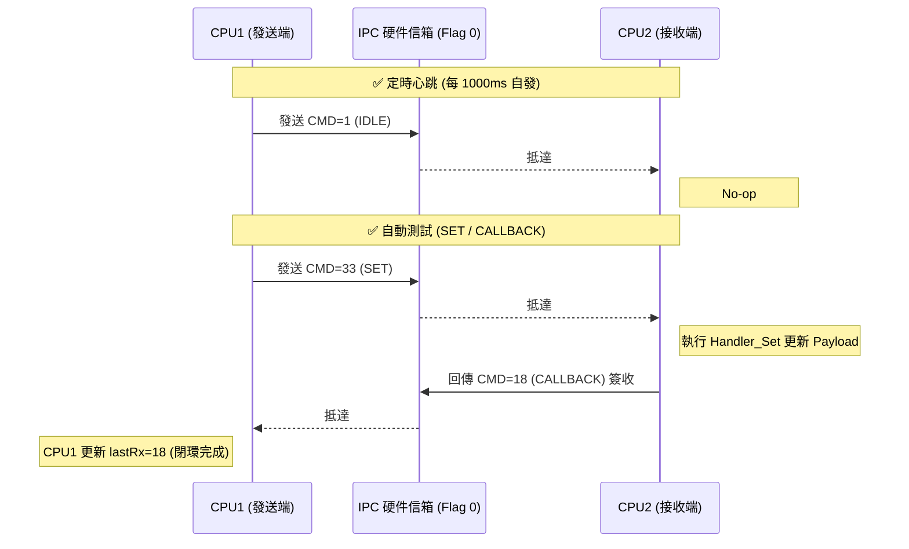

# IPC 模組專家驗證手冊 (Expert Verification Manual)

本手冊指導您如何在 TI CCS 環境下，透過 Watch Window 進行深度的通訊驗證與壓力測試。本手冊整併了早期版本中的測試與偵錯指南。

---

## 1. 偵錯準備 (Setup)
請在 CCS 的 **Expressions (Watch Window)** 中加入並展開變數：

1.  **`IPC_ctl`**: 核心控制上下文 (Context)
2.  **`IPC_ctl.psLocalShm`**: 本機共享記憶體
3.  **`IPC_ctl.psRemoteShm`**: 對端共享記憶體
4.  **`IPC_ctl.eState`**: 監控狀態機 (0:IDLE, 1:SYNC, 2:RUN, 4:ERR)
5.  **`IPC_ctl.eMode`**: 組合測試模式控制
6.  **`IPC_ctl.u32LastRx`**: 即時收信監控

---

## 2. 指令與交互邏輯

### 2.1 指令 ID 通解表 (Complete Command ID Map)
當您看到以下**十進制**數值時，對應含義如下：

| 十進制 (Dec) | 十六進制 (Hex) | 指令名稱 (Command) | 說明 (Description) |
| :--- | :--- | :--- | :--- |
| **1** | 0x01 | `IPC_CMD_IDLE` | 心跳/閒置 (Heartbeat) |
| **5** | 0x05 | `IPC_CMD_STOP` | 緊急停機 (Shutdown) |
| **14** | 0x0E | `IPC_CMD_CLEAR_FAULT` | 故障復歸 (Clear Error) |
| **16** | 0x10 | `IPC_CMD_BASIC_SEQ` | 自動測試脈衝 (Test Pulse) |
| **17** | 0x11 | `IPC_CMD_GET` | 數據請求 (Fetch) |
| **18** | 0x12 | `IPC_CMD_CALLBACK` | 簽收回報 (Receipt/Ack) |
| **33** | 0x21 | `IPC_CMD_SET` | 變數注入 (Write/Inject) |
| **37** | 0x25 | `IPC_CMD_ENABLE_PWM` | 啟動 PWM 輸出 |
| **38** | 0x26 | `IPC_CMD_DISABLE_PWM` | 禁止 PWM 輸出 |

### 2.2 交互時序

---

## 3. A 類測試：指令手動注入 (Command Injection)
用於手動發送 A 類指令給對端。

### 步驟：
1.  **設定指令 (eInjectCmd)**: 修改為 `IPC_CMD_SET` (0x21)。
2.  **設定參數**:
    *   **`u32InjectAddr`**: 邏輯索引對應如下：
        *   **0**: `f32Vin` (電壓遙測)
        *   **1**: `f32Iout` (電流遙測)
        *   **2**: `u32Stat` (狀態字)
    *   **`u32InjectD1`**: 原始 32-bit 資料（浮點數請輸入 Hex，如 100.0f = `0x42C80000`）。
3.  **觸發發送 (u16InjectTrig)**: 將其設定為 **1**。發送成功後會由 `IPC_Test_Engine` 自動清零。
4.  **驗證**:
    *   查看自己的 `u32LastTx`。
    *   查看對端的 `u32LastRx` 是否變為 **33**。
    *   查看對端的 `u32LastTx` 是否變為 **18** (CALLBACK 閉環)。

---

## 4. 自動化測試模式 (Auto Test Modes)
修改 `eMode` 切換以下模式：

| eMode 值 | 模式名稱 | 說明 |
| :--- | :--- | :--- |
| **1** | `TEST_MODE_BASIC_SEQ` | **自動測試序列**: 定期發送 SET 指令驗證閉環。 |
| **2** | `TEST_MODE_TRAFFIC_RAMP` | **數據流鋸齒波**: 在 `stPayload.f32Vin` 產生 100~200 鋸齒波，驗證 B 類模式。 |
| **3** | `TEST_MODE_STRESS_FLOOD` | **極限壓力**: 無間隔填寫指令。觀察 `u32TxDrop` 以驗證硬體吞吐量。 |
| **4** | `TEST_MODE_STRESS_BURST` | **四連發壓力**: 瞬間塞滿 4 筆 Packet。 |

---

## 5. 安全與故障測試 (Safety Injection)
1.  **注入故障**: 設定 `eMode` 為 `TEST_MODE_SAFETY_FAULT` (5)。
    *   系統應立即變為 `IPC_STATE_ERR` (4)。
    *   本地與對端的 `u32ErrorCode` 應反映強停狀態。
2.  **故障恢復**: 設定 `eMode` 為 `TEST_MODE_SAFETY_CLEAR` (6)。
    *   系統應回歸 `IPC_STATE_RUN` (2)。
    *   故障碼自動清零。

---

## 6. 疑難排解 (Troubleshooting)
*   **心跳中斷**: 若 `u32TimestampHW` 不動，檢查對端核心是否 HLT 或死循環。
*   **指令丟失 (TX Drop)**: 若 `u32TxDrop` 增加，代表發送過快超過 Flag 握手極限 (100kHz 頻率下，單筆 A 類指令握手約需 1-2us)。
*   **接收錯誤 (RX Err)**: 檢查是否發送了未註冊的非法指令 ID。
