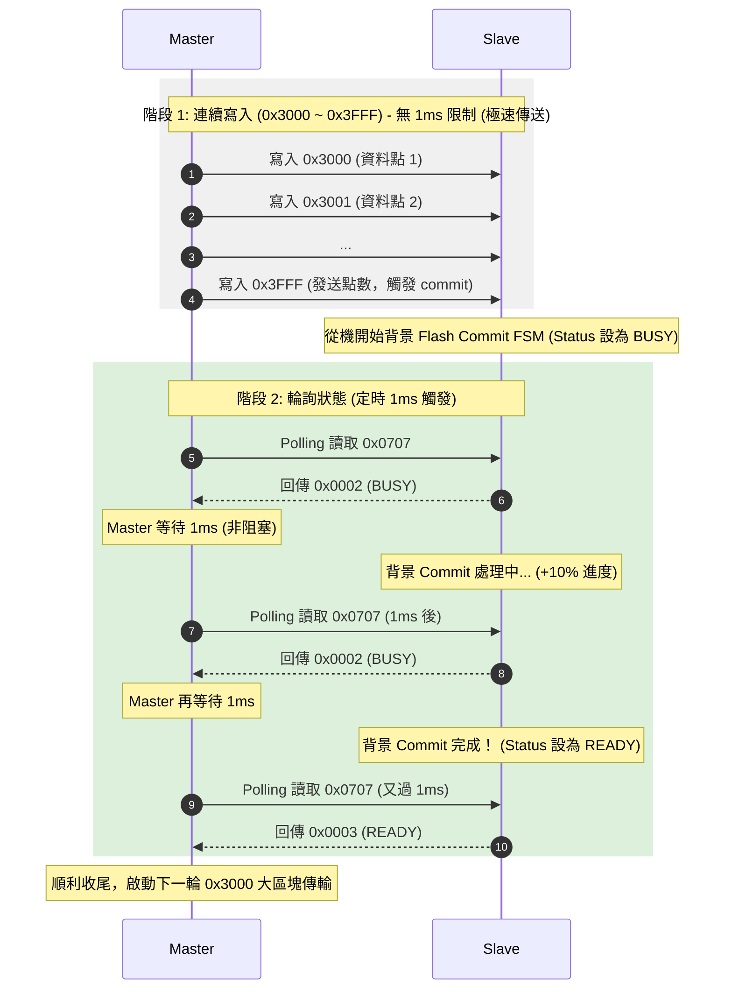

---

## 系統是什麼

ASR-5000 系列電源供應器。C2000 DSP 是 Slave，負責控制儀器輸出和量測。Master 是上位機，透過 SPI 遠端操控和監控。

SPI 在這個系統裡同時扮演兩個角色，控制面負責讀寫暫存器、改變儀器行為，資料面負責搬移波形資料和校準係數。

---

## Address Map

```
0x0000 ~ 0x03FF   Reserved
0x0400 ~ 0x08FF   Read Register    量測數據、狀態（唯讀）
0x0900 ~ 0x0FFF   Write Register   控制命令（唯寫）
0x1000 ~ 0x1FFF   V Raw Data       電壓時域取樣 4k 點
0x2000 ~ 0x2FFF   I Raw Data       電流時域取樣 4k 點
0x3000 ~ 0x3FFE   Wave Data        波形資料視窗（分頁）
0x3FFF            Block End        結束信號，觸發後續動作
```

Wave Data 視窗固定在 `0x3000~0x3FFF`，透過 `0x0958` 切換 page，對應 19 組波形（ARP1~16、SINE、SQUARE、TRIANGLE）。

---

## 三條路徑的分工

```
Fast Path
  對象：單一暫存器讀寫，Version、Status、Output ON/OFF 等
  時間尺度：幾 us 內回應
  實作：tryHandleFastPath() 直接回應，不進 ring buffer

Block RAM Path
  對象：波形資料，最多 4095 點
  時間尺度：每包立刻收進 RAM，不做慢事
  實作：tryHandleBlockPath()，寫進 g_u16SpiBlockRam[]

Background Path
  對象：RAM 資料搬到最終目的地
  時間尺度：慢慢做，不影響 SPI 收發
  實作：handleBackgroundFlashCommit()，背景 FSM
```

三條路徑共存，互補，不衝突。

---

## 波形資料的完整流程

**舊版（直接寫 SDRAM）：**

```
SPI 每收一點 → 直接寫 SDRAM → 儀器立刻用新波形
問題：傳輸中斷時 SDRAM 是半新半舊的損毀波形
```

**新版設計目標（加緩衝層）：**

```
SPI 每收一點 → 寫 g_u16SpiBlockRam[]
收到 0x3FFF  → 確認點數正確
點數正確      → DMA 搬 BlockRam → SDRAM
DMA 完成      → 觸發 Preload_WAVE_DATA 事件
              → 設 BlockStatus = READY
              → Master polling 得知完成

點數錯誤      → 丟棄 BlockRam，SDRAM 保留舊波形
```

優點是傳輸失敗不影響儀器輸出，SDRAM 永遠是完整的波形。

---

## 目前的實作狀態

```
已完成：
  SPI Master FSM               單次交易、Block 傳輸、Polling
  tryHandleFastPath()          常用命令即時回應
  tryHandleBlockPath()         0x3000~0x3FFE 寫進 BlockRam
  handleBackgroundFlashCommit() 背景 FSM 框架

待完成：
  DMA：BlockRam → SDRAM        硬體還沒打通
  SDRAM 寫入測試               還沒測
  FLASH_COMMIT_DONE 裡的
  Preload_WAVE_DATA 事件觸發   等 DMA 通了再接

已知問題：
  u16FlashCommitPending 無效    tryHandleBlockPath() 直接設
                                eFlashState = BUSY，
                                背景 FSM 的 IDLE 判斷永遠不會執行
  新 Block 開始前沒有檢查
  eFlashState 是否還在 BUSY    可能導致 BlockRam 被覆寫
  而背景 FSM 還在讀舊資料
```

---

## 下一步

優先順序建議：

```
1. 修掉 u16FlashCommitPending 的邏輯不一致
2. 在 tryHandleBlockPath() 的 0x3000 入口
   加上 eFlashState == BUSY 時回 BUSY 的守衛
3. DMA 打通後接上 FLASH_COMMIT_BUSY 的搬移邏輯
4. DMA 完成中斷設 eFlashState = DONE
5. FLASH_COMMIT_DONE 裡觸發 Preload_WAVE_DATA
6. SDRAM 測試
```

現在要處理的是「待完成」和「已知問題」這兩個區塊，
從修掉 u16FlashCommitPending 的邏輯不一致開始。

## 時序與連續寫入協定關聯


