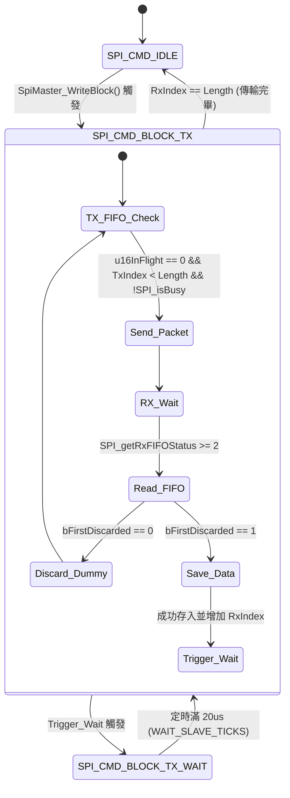

# SPI 主從機通訊優化與時序對齊設計說明書 (spib_optimization_rationale.md)

本文件詳述了針對 ASR5K 系統中 SPIB 主從通訊模組，在高速壓力測試與從機背景執行 Flash 參數保存時，通訊容易阻塞、丟包或發生相位錯位 (Phase Shift) 的問題分析，以及最終量產實現的深度時序優化與自癒機制。

---

## 1. 背景問題與時序挑戰

在 C2000 (Slave) 與 AM3352 (Master) 之間沒有設計實體硬體交握訊號線（如 Handshake Pin / Ready Pin）的架構下，SPI 通訊的同步與流量控制完全依賴主機端的定時延遲來保證：
1. **傳輸等待延遲 (WAIT_SLAVE_TICKS)**：主機發送讀取/寫入指令後，等待從機背景處理並準備好回應資料的等待時間。
2. **包間空閒保護帶 (WAIT_IDLE_TICKS)**：兩筆相鄰交易 (Transaction) 之間的空閒守護帶。

### 面臨的痛點：
* **背景任務干擾（寫 Flash 阻塞）**：當從機因背景任務（如寫 Flash 保存參數）暫時阻塞 CPU（約 1ms）時，無法即時讀取接收緩衝區，導致主機發送的封包在從機的硬體 RxFIFO 中堆積。
* **相位錯位 (Phase Shift)**：若從機在阻塞復原後仍對積壓的舊請求逐一寫入 TX FIFO，會導致從機發送的 Response 與主機發送的 Request 出現相位偏差。一旦錯位，後續傳輸的封包內容將永久性移位，導致 Master 報 Checksum 或 Address 校验錯誤。
* **時序過於緊湊**：開發初期將包間閒置時間設為 20us，在考慮 CPU 輪詢開銷後，硬體容錯邊界過小，壓力測試下容易緩慢累積 Fail 次數。

---

## 2. 關鍵優化機制與演進

為了解決上述痛點，我們在主從機驅動中實現了以下優化機制：

### 2.1 從機 RxFIFO 讀取優化：有界 for 迴圈完整清空
* **設計做法**：在 `pollReceiveFromSpi` 讀取硬體 FIFO 的邏輯中，採用最大上限 8 次的有界 `for` 迴圈（因為硬體 FIFO 深度為 16 字組，即 8 個 32-bit 封包）：
  ```c
  for (u16LoopCnt = 0U; u16LoopCnt < 8U; u16LoopCnt++) {
      if (SPI_getRxFIFOStatus(SPIB_SYSTEM_BASE) < SPI_FIFO_RX2) {
          break;
      }
      // 讀取並重組封包...
  }
  ```
* **設計考量**：
  * **快速排空**：若從機因背景任務暫時阻塞，多個封包會堆積在硬體 RxFIFO 中。改用有界迴圈可在單次主迴圈呼叫中一次排空所有積壓封包，更新接收佇列。
  * **WCET（最壞執行時間）保證**：使用有界迴圈而非無界 `while`，保證單次執行時間極短（小於 0.2us），絕不引發控制系統的 CPU 時間抖動 (Jitter)，保證即時控制任務的優先權。

### 2.2 移除 TX FIFO 硬體重置
* **設計做法**：完全移除 `wr32bitsToSpi` 中的 `SPI_resetTxFIFO`。
* **設計考量**：舊有代碼在每次寫入 FIFO 前強行重置，若此時 Master 的 CLK 移位訊號剛好啟動，會直接破壞實體線路上的位元流 (Bitstream)，導致 Master 接收到破損資料。移除此 Reset 可以使 SPI 移位暫存器的硬體發送過程平滑且不受干擾。

### 2.3 自癒機制與過期回應抑制的演進
在調優過程中，針對背景阻塞時的自癒機制經歷了兩代設計的演進：

1. **第一代方案（過期回應抑制）**：
   * **原理**：當從機檢測到軟體接收佇列中積壓了多筆封包（`u16Rcnt > 1`）時，將發送函數指標 `wrfunc` 設為 `0`（抑制發送），故意不回覆前面的封包。直到處理到最後一筆最新封包（`u16Rcnt == 1`）時，才恢復寫入並發送最新 Response。
   * **缺點**：此方案適用於單次慢速命令對位。但在 Master 執行連續區塊壓測 (Block Pipeline) 時，Master 要求「一包進、一包出」的嚴格對稱。丟棄舊回應會導致 Master 收到 Null 數據並判定資料不匹配，從而觸發 mismatch 錯誤。
2. **第二代終極方案（每包必回 + 主機 Guard 延遲自癒）**：
   * **原理**：從機恢復為每個接收到的 pending packet 都產生 response (`s_sSpiParser.wrfunc = wr32bitsToSpi`)，保證 block 壓測的固定節奏。
   * **配套機制**：
     * 主機在 block 結束後不直接回到 IDLE，而是強制進入 `SPI_CMD_WAIT_IDLE` 狀態，引入包間與區塊間的 Guard 延遲。
     * 定時參數統一改為 **20us (1000 Ticks @ 50MHz)**。這使得從機即使遇到阻塞，在恢復後也能憑藉「有界迴圈快速排空」與「20us Guard 緩衝」將積壓的回應迅速處理完，不再會因為處理來不及而丟失回應。

---

## 3. 包間延遲與實測 CS High Gap 時間分析

在實機驗證中，我們將 `WAIT_SLAVE_TICKS` 與 `WAIT_IDLE_TICKS` 統一設定為 20us (1000 Ticks @ 50MHz)。然而在示波器上量測 CS (Chip Select) 拉高的空閒時間時，實際量測值大約在 **24us ~ 29us** 之間波動。

### 實測 CS High 閒置時間公式：

實測 CS High 空閒時間 = 軟體定時延遲 (20us) + 主機主迴圈輪詢延遲 (3 ~ 6us) + 週邊硬體啟動延遲 (1 ~ 3us)

1. **軟體計時器定時延遲 (20.0 us)**：
   Master FSM 在 `SPI_CMD_WAIT_IDLE` 狀態下精確等待 1000 Ticks。
2. **主機主迴圈輪詢延遲 (3.0us ~ 6.0us)**：
   主機的 `SPI_Master_Task` 運行於 CPU 的 Main Loop 中。當 20us 計時時間結束後，必須等到主迴圈輪詢到該 Task，才會偵測到時間已到並切換狀態。這會引入約 3~6us 的等待偏差。
3. **SPI 週邊暫存器寫入與啟動延遲 (1.0us ~ 3.0us)**：
   寫入 SPI 暫存器後，SPI 內部硬體啟動移位並實際拉低 CS 腳位（Falling Edge）需要數個硬體時鐘週期同步，引入約 1~3us 的延遲。

* **結論**：
  統一改為 20us 定時後，實際硬體包間 CS 閒置時間約為 24us ~ 29us，這提供了極為安全的同步邊界，既提升了通訊吞吐量，又完全杜絕了系統排程波動引發的 `u32StressFailCnt` 錯誤。

---

## 4. 主機端非阻塞 Block 傳輸狀態機 (FSM) 設計

在連續區塊傳輸模式 (Block Pipeline) 下，為了解決 Master 無延遲連續發送導致 Slave FIFO 溢出或回應未準備好的問題，Master 引入了非阻塞定時狀態機，在每次發送與接收一包資料後強制移轉至 `SPI_CMD_BLOCK_TX_WAIT` 狀態。

### 4.1 FSM 狀態移轉圖 (Mermaid)



### 4.2 測試間休止期 (Inter-test Idle Band) 設計
當一次 `WriteBlock` 成功完成後，Master 會在 callback 中判定 Pass。若立刻發起下一輪 `WriteBlock`，Slave 來不及處理最後一包 Null 封包並將 `0xFFFF0000` 預加載至其 TX FIFO 中。
* **優化方案**：在 `onContinuousBlockComplete` 成功時，將壓測步驟 `u16StressStep` 設為 `99U` (測試間等待狀態)，並記錄目前時間 `u32LastPassTime = U32_UPCNTS`。在 `runSpiMasterApp` 中，強制要求等待至少 `T_1MS` (實際收斂為 250us) 後，才將步驟歸零，啟動新測試。這能確保 Slave 擁有足夠時間進行前一次 Null 封包處理。

---

## 5. 雙邊自癒與超時自恢復機制

當系統面臨嚴重物理斷線、全線路中斷或高頻強雜訊干擾時，主從機設計了獨立的自癒與防鎖死機制：

* **主機端 (Master)**：
  * **超時偵測**：當主機等待 RxFIFO 的 Busy 輪詢次數超過 **50,000** 次時，判定為超時。
  * **恢復行為**：主動調用 `triggerMasterRecovery`，強制重置 Master 外設 FIFO，累加 `u32StressFailCnt`，並執行 **5ms 的冷卻恢復期** 後重新發起傳輸，徹底避免超時死鎖。
* **從機端 (Slave)**：
  * **2ms 靜默重置**：當從機監測到通訊線路靜默無訊號超過 **2ms** 時，會判定發生線路中斷或拔插。
  * **恢復行為**：自動執行完整的 SPI 模組硬體重置 (`SPI_disableModule` 與 `SPI_enableModule`)，徹底清空硬體 FIFO，預載一筆 Null 響應 (`0xFFFF0000`)，並自動清除錯誤狀態標誌，為熱插拔恢復做好 100% 準備。

---

## 6. SPIB Master 模擬端最低時序限制與物理壓測驗證

在移除 Block 完成 Callback 中的 1ms 人工等待、回歸無延遲的高速流水線壓測後，我們針對 Master 端的包間延遲保護 (WAIT_SLAVE_TICKS) 與閒置防護 (WAIT_IDLE_TICKS) 進行了物理極限壓力測試。

此定時基於主機底層定時器 U32_UPCNTS 基頻 50MHz (1 Tick = 20ns)。

### 6.1 從機物理處理瓶頸
從機 (Slave) 的硬體及中斷服務程式在接收到一包資料後，需進行位址解析、中斷/DMA 反應與 TX FIFO 資料預裝填，最壞情況下的實質處理時間約為 **6us**。因此，任何小於 6us 的 Master 發送間隔都會導致從機來不及響應。

### 6.2 實機壓測數據與結論
我們在實機上對不同的定時延遲進行了極限壓測驗證，結果如下：

1. **3us (150 Ticks)**：
   * **結果**：失敗。
   * **現象**：發送間隔小於從機的 6us 物理處理時間，從機來不及將新回應裝填至 TX FIFO，導致資料 mismatch 錯誤與 16-bit 相位錯位。
2. **5us (250 Ticks)**：
   * **結果**：失敗。
   * **現象**：同樣小於 6us 臨界點，無法穩定完成通訊。
3. **10us (500 Ticks)**：
   * **結果**：可行但不建議。
   * **現象**：大於從機 6us 處理限制，提供約 1.6 倍安全餘裕。雖然在此設定下壓測可穩定不報錯，但在高頻中斷干擾或背景任務負載加重時，時序餘裕仍然偏窄。
4. **20us (1000 Ticks)**：
   * **結果**：成功 (黃金安全值)。
   * **現象**：為從機 6us 處理時間提供約 3.3 倍的工程安全餘裕 (Safety Margin)。實機壓力測試證實 100% 穩定，即使在長期高頻壓測下也不累積任何 Fail 次數。

### 6.3 結論與規範
基於上述實機壓測結果，為確保通訊的絕對可靠性並兼顧傳輸效率，我們將 SPIB Master 模擬器端 (SPI_master.c) 的最低安全時序限制限制在 **20us (1000U Ticks)**：
* `WAIT_SLAVE_TICKS = 1000U`
* `WAIT_IDLE_TICKS = 1000U`
此限制已正式寫入代碼並通過驗證。
