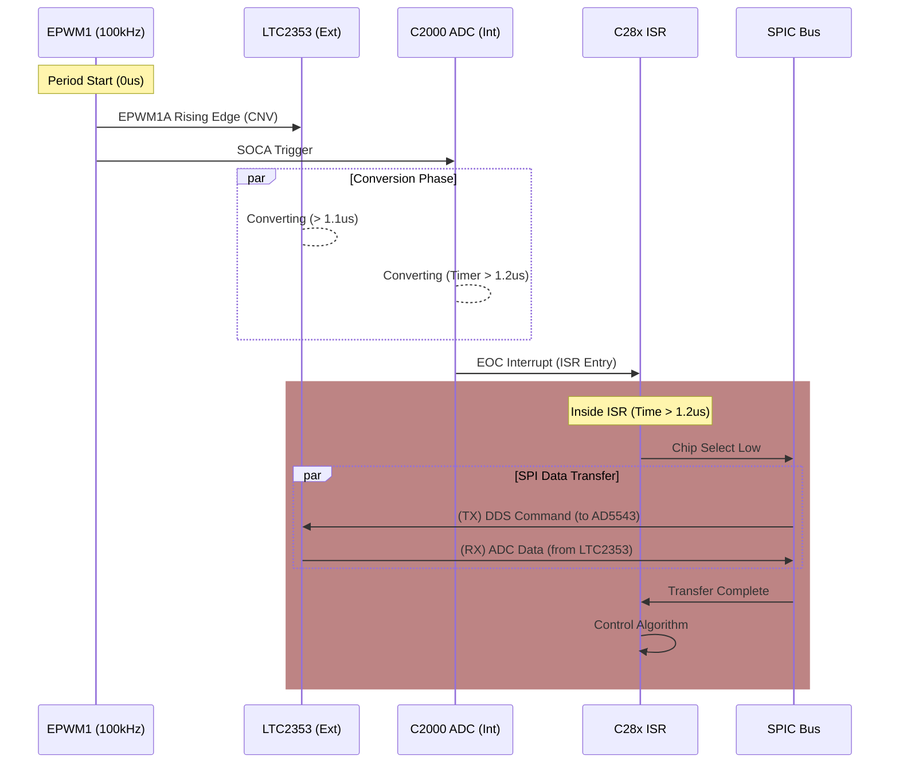
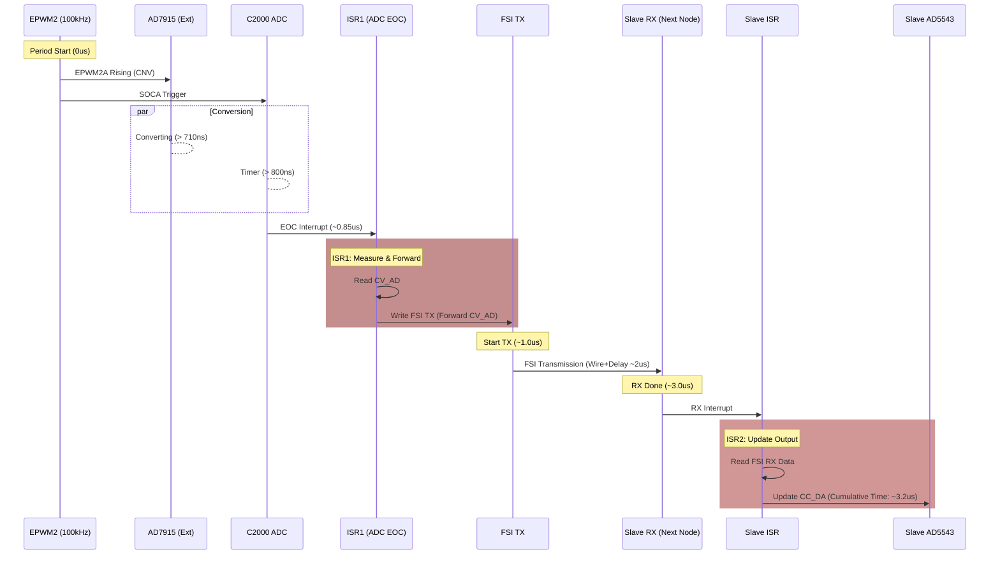
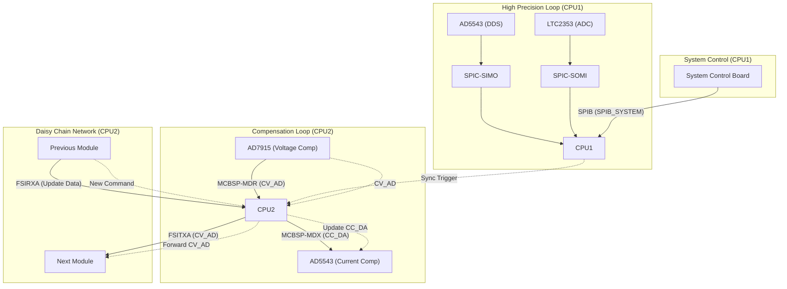

# D01 - 專案控制架構設計 (Design Control Architecture)

## 1. 系統概要 (System Overview)

本文件基於 `pinmux.syscfg` 配置與系統需求，定義 GW_ASR5K_F28384D 專案之關鍵控制介面與資料流架構。

系統核心由 F28388D 實現，主要涵蓋精密測量 (DDS/ADC)、電壓/電流補償控制 (MCBSP)、分散式串接通訊 (FSI) 以及上層命令接收 (SPI Slave)。

---

### 1.1 硬體環境與限制 (Hardware & Constraints)

*   **MCU**: TMS320F28388D
*   **核心資源分配 (Core Allocation)**:
    *   **CPU1**: **高精度測量核心 (High Precision Measurement)**。
        *   負責 `SPIC` (DDS + LTC2353)、系統命令 (`SPIB_SYSTEM`)。
    *   **CPU2**: **補償控制核心 (Compensation Control)**。
        *   負責 `MCBSP` (AD7915 + AD5543)、`FSI` 通訊鏈路 (TX/RX)。
    *   **CLA1 & CLA2**: 可輔助運算 (例如 FFT 或濾波器)，目前尚未指派。
    *   **CM (Connectivity Manager)**: **不使用 (Not Used/Disabled)**.
*   **即時性要求**: SPIC 需滿足嚴格的 100kHz 控制迴路。

## 2. 關鍵介面分析與設計 (Interface Analysis & Design)

### 2.1 精密信號測量介面 (SPIC - Precision Measurement)

**優先級：最高 (Most Critical)**

此介面負責控制高精度 DDS (AD5543) 並同步回讀 ADC (LTC2353) 資訊，確保信號生成的穩定性與測量的準確性。

*   **核心時序要求 (Critical Timing Requirements)**:
    *   **更新頻率 (Update Rate)**: **100kHz (10us)** 嚴格執行。
    *   **同步操作 (Simultaneous Operation)**: 在每個 10us 週期內，必須**同時**完成：
        1.  **TX Output**: 推送最新的 DDS 點位至 AD5543。
        2.  **RX Input**: 從 LTC2353 讀回一組電壓/電流同時取樣的數值。
    *   **Jitter**: 需確保極低抖動 (Jitter-free) 以維持波形精度。

*   **硬體資源**: `SPIC` (SysConfig Name: `SPIC_MEAS_DDS`)
*   **功能描述**:
    *   **TX (SIMO)**: 推送 DDS 控制命令至 AD5543 (Waveform Generation)。
    *   **RX (SOMI)**: 同步回讀 LTC2353 之 ADC 採樣值。
    *   **時序要求**: 需確保 SPI 時脈與轉換時序精確對齊，以維持 DDS 輸出之抖動 (Jitter) 最小化。
*   **腳位配置**:
    *   `GPIO100` (SPISIMOC) -> AD5543 (SDI)
    *   `GPIO101` (SPISOMIC) <- LTC2353 (SDO)
    *   `GPIO102` (SPICLKC) -> Clock
    *   `GPIO103` (SPISTEC) -> Chip Select

### 2.1.1 Measurement Timing & Synchronization Strategy (測量時序同步策略)

由 **EPWM1A (GPIO145)** 作為全系統的 **Master Trigger**，確保內外部 ADC 與 DDS 的時序嚴格同步。

1.  **觸發源 (Trigger Source)**:
    *   **EPWM1**: 設定為 `Up-Count` 或 `Up-Down` 模式，週期為 **10us (100kHz)**。
    *   **EPWM1A (GPIO145)**: 輸出固定寬度的 Pulse，直接連接至 **LTC2353 (CNV)** 腳位，觸發外部 ADC 開始轉換。
    *   **EPWM1_SOCA**: 同一時刻 (或些微延遲) 觸發 C2000 內部的 **ADC (ADCA/ADCB/ADCC...)** 開始採樣與轉換。

2.  **轉換同步 (Conversion Sync)**:
    *   **LTC2353**: 轉換時間 (tCONV) 需滿足 **> 1.1 us** (1100ns)。
    *   **C2000 ADC**: 設定其 **Acquisition Window (ACQPS)** 與轉換時間，使其總時間 **大於 1.1 us** (建議設定 ACQPS = 200，約 1.2us)。
    *   **目的**: 確保當 C2000 ADC 完成轉換並觸發中斷 (ISR) 時，外部的 LTC2353 也必然已經完成轉換，數據已準備好被讀取。

3.  **中斷服務 (ISR Action)**:
    *   **觸發點**: C2000 ADC **End of Conversion (EOC)** -> 觸發 ISR。
    *   **ISR 執行內容**:
        1.  **SPI Transaction**: 透過 `SPIC` 進行雙向傳輸。
            *   **TX**: 送出 **DDS (AD5543)** 的控制命令 (更新下一個點的電壓)。
            *   **RX**: 讀回 **LTC2353** 剛剛轉換完成的電壓/電流數據。
        2.  **Algorithm**: 執行控制演算法 (計算下一個 DDS 值)。

**時序圖 (Timing Diagram)**:

### 2.2 電壓/電流補償控制介面 (MCBSP - Compensation Loop)

**優先級：次高 (Second Critical)*

此介面構成快速硬體補償迴路，同時負責電流命令輸出與電壓回授採樣。

*   **硬體資源**: `MCBSPA` (SysConfig Name: `McBSPA_CVAD_CCDA`)
*   **功能描述**:
    *   **TX (DX)**: 送出 `CC_DA` (Current Compensation DA) 命令至另一顆 AD5543，控制硬體電流補償器。
    *   **RX (DR)**: 讀取 `CV_AD` (Voltage Compensation AD) 來自 AD7915，獲取硬體電壓補償器之輸出狀態。
    *   **控制邏輯**: `CV_AD` 讀值將作為下階段 FSI 傳輸之輸入資料。
*   **腳位配置**:
    *   `GPIO165` (MDXA) -> AD5543 (CC_DA)
    *   `GPIO166` (MDRA) <- AD7915 (CV_AD)
    *   `GPIO167` (MCLKXA) -> Clock (TX)
    *   `GPIO7` (MCLKRA) <- Clock (RX)
    *   `GPIO168` (MFSXA) -> Frame Sync (TX)
    *   `GPIO5` (MFSRA) <- Frame Sync (RX)

### 2.2.1 Compensation Loop Timing & CPU2 Strategy (補償迴路時序策略)

由 **CPU2** 專責處理，以 **EPWM2A (GPIO147)** 為觸發源，實現 100kHz 閉迴路控制。

1.  **觸發源 (Trigger Source)**:
    *   **EPWM2**: 設定為 **100kHz (10us)**，與 CPU1 的 EPWM1 同步。
    *   **EPWM2A (GPIO147)**: 觸發 **AD7915 (CNV)** 開始轉換。
    *   **EPWM2_SOCA**: 觸發 C2000 內部的 ADC，作為**計時器 (Timer)** 使用。

2.  **轉換同步 (Conversion Sync)**:
    *   **AD7915**: 轉換時間 (tCONV) 需滿足 **> 710 ns**。
    *   **C2000 ADC**: 設定 ACQPS + Conversion Time > 710 ns (建議設定 ACQPS = 120，約 0.8us)。
    *   **目的**: 利用 C2000 ADC 完成轉換的 EOC 中斷，確保 AD7915 數據已備妥。

3.  **ISR 1: ADC EOC (Measurement & FSI TX)**:
    *   **觸發**: C2000 ADC EOC (High Priority).
    *   **動作**:
        1.  **Read Local Feedback**: 讀取 MCBSP `DRR` 暫存器 (取得本機 AD7915 的 `CV_AD`)。
        2.  **Send to Loop**: 將 `CV_AD` 寫入 **FSI TX**，傳送給下一個模組 (Daisy Chain)。

4.  **ISR 2: FSI RX (Command Update)**:
    *   **觸發**: FSI RX Frame Received (High Priority).
    *   **動作**:
        1.  **Receive Command**: 讀取 FSI RX 封包 (取得來自環路的 `CC_DA` 或其他命令)。
        2.  **Update Local Output**: 將 `CC_DA` 寫入 MCBSP `DXR` 暫存器 (更新本機 AD5543 輸出)。

**衝突分析**:
*   這兩個 ISR 雖然有時序關聯，但操作的是 MCBSP 的不同暫存器 (`DRR` vs `DXR`)，硬體上全雙工無衝突。
*   FSI RX 中斷發生時間點取決於環路延遲，屬於非同步事件，CPU2 需設為高優先權處理以減少延遲。

*   FSI RX 中斷發生時間點取決於環路延遲，屬於非同步事件，CPU2 需設為高優先權處理以減少延遲。

**補償迴路時序圖 (Compensation Loop Timing - Node Level)**:

**關鍵路徑延遲分析 (Critical Path Latency Analysis)**:
從控制週期開始 (PWM Trigger) 到 Slave 輸出更新 (CC_DA Update) 的總延遲約為 **3.2 μs**。
1.  **ADC Conversion (0 ~ 0.85 μs)**:
    *   AD7915 轉換時間 (> 710ns) + C2000 ACQPS 安全餘裕。
2.  **CPU2 Processing (0.85 ~ 1.0 μs)**:
    *   ISR 進入延遲 + 讀取 ADC 結果 + 寫入 FSI TX Buffer。
3.  **FSI Transmission (1.0 ~ 3.0 μs)**:
    *   FSI 線路傳輸時間 (Wire Time ~1.42us) + 硬體 Pipeline 延遲。
4.  **Slave Update (3.0 ~ 3.2 μs)**:
    *   Slave RX 中斷響應 + 更新 MCBSP 資料至 DAC。

### 2.3 分散式菊花鍊通訊 (FSI - Daisy Chain Communication)

**架構：Ring / Daisy Chain**

負責將補償迴路採樣之電壓資訊 (`CV_AD`) 傳送至總線，並從總線接收更新後的電流命令 (`CC_DA`)。

*   **硬體資源**:
    *   **TX**: `FSITXA` (SysConfig Name: `FSI_DAISY_TX`)
    *   **RX**: `FSIRXA` (SysConfig Name: `FSI_DAISY_RX`)
*   **詳細設計**: 請參考 **[R02_1_FSI_DESIGN.md](./R02_1_FSI_DESIGN.md)**
*   **資料流 (Data Flow)**:
    1.  **CV_AD 採樣**: 由 MCBSP 取得 `CV_AD` 數值。
    2.  **FSI TX 傳送**: CPU 將 `CV_AD` 透過 `FSITXA` 送出至 Bus (下一級模組)。
    3.  **FSI RX 接收**: 透過 `FSIRXA` 從 Bus (上一級模組) 接收資料封包。
    4.  **CC_DA 更新**: 解析 RX 封包內容，取出新的補償命令，並更新至 MCBSP 的 `CC_DA` 輸出。
*   **腳位配置**:
    *   **TX**: `GPIO0` (D0), `GPIO1` (D1), `GPIO2` (CLK)
    *   **RX**: `GPIO12` (D0), `GPIO11` (D1), `GPIO13` (CLK)

### 2.4 系統監控介面 (SPIB - System Matrix Slave)

**角色：Slave (受控端)**

作為系統控制板 (Master) 的下層裝置，接收上層指令並回報狀態。

*   **硬體資源**: `SPIB` (SysConfig Name: `SPIB_SYSTEM`)
    *   *注意：SysConfig 名稱為 `SPIB_SYSTEM`，底層映射至 F28388D 之 `SPIB` 模組，名稱與實體介面一致。*
*   **功能描述**:
    *   接收 Operation Mode、Parameter Settings 等系統級命令。
    *   回傳 Module Status、Faults 等資訊。
*   **腳位配置**:
    *   `GPIO63` (SPISIMOB) <- Master Out
    *   `GPIO64` (SPISOMIB) -> Master In
    *   `GPIO65` (SPICLKB) <- Master Clock
    *   `GPIO66` (SPISTEB) <- Master CS

---

## 3. 信號所使用的資源總表 (Pinmux Summary)

| 功能群組 (Group) | SysConfig Name     | Hardware Resource | Control Signals | GPIO Pin | Direction | Function      |
| :--------------- | :----------------- | :---------------- | :-------------- | :------- | :-------- | :------------ |
| **DDS/ADC**      | `SPIC_MEAS_DDS`    | **SPIC**          | SIMO            | GPIO100  | Out       | DDS Command   |
|                  |                    |                   | SOMI            | GPIO101  | In        | ADC Data      |
|                  |                    |                   | CLK             | GPIO102  | Out       | SPI Clock     |
|                  |                    |                   | STE             | GPIO103  | Out       | Chip Select   |
| **Compensation** | `McBSPA_CVAD_CCDA` | **MCBSPA**        | MDX             | GPIO165  | Out       | CC_DA Output  |
|                  |                    |                   | MDR             | GPIO166  | In        | CV_AD Input   |
|                  |                    |                   | MCLKX           | GPIO167  | Out       | TX Clock      |
|                  |                    |                   | MFSX            | GPIO168  | Out       | TX Frame Sync |
| **Daisy Chain**  | `FSI_DAISY_TX`     | **FSITXA**        | TX_D0           | GPIO0    | Out       | FSI Data 0    |
|                  |                    |                   | TX_D1           | GPIO1    | Out       | FSI Data 1    |
|                  |                    |                   | TX_CLK          | GPIO2    | Out       | FSI Clock     |
|                  | `FSI_DAISY_RX`     | **FSIRXA**        | RX_D0           | GPIO12   | In        | FSI Data 0    |
|                  |                    |                   | RX_D1           | GPIO11   | In        | FSI Data 1    |
|                  |                    |                   | RX_CLK          | GPIO13   | In        | FSI Clock     |
| **System Host**  | `SPIB_SYSTEM`      | **SPIB**          | SIMO            | GPIO63   | In        | Command RX    |
|                  |                    |                   | SOMI            | GPIO64   | Out       | Status TX     |
|                  |                    |                   | CLK             | GPIO65   | In        | Host Clock    |
|                  |                    |                   | STE             | GPIO66   | In        | Host CS       |

## 4. 資料流架構圖 (Data Control Flow)

