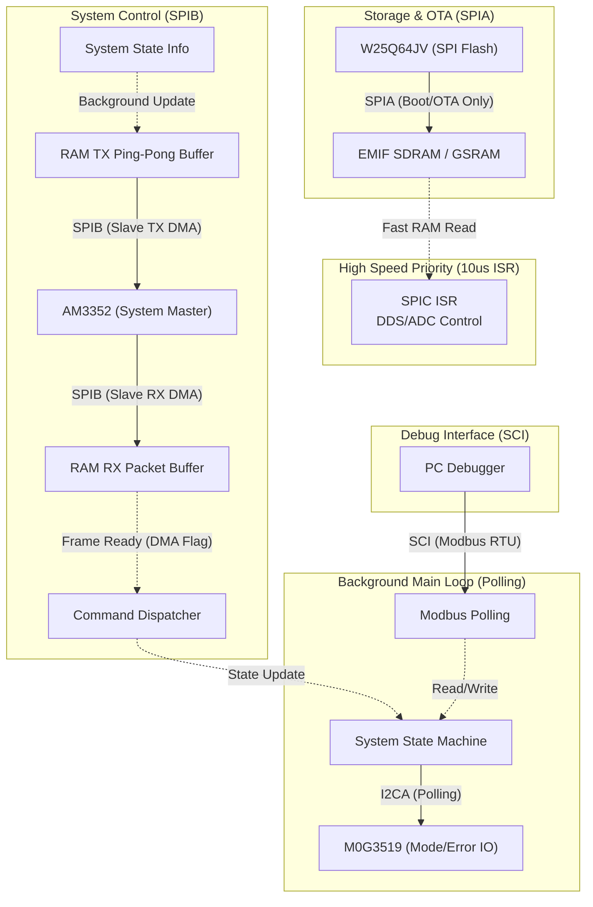

# D02 - 周邊通訊與擴充架構設計 (Peripheral & Communication Architecture)

## 1. 系統概要 (Overview)

本文件基於 D01 所定義的核心控制架構進行延伸。在系統滿足 100kHz 高精度測量與補償控制 (SPIC/MCBSP/FSI) 的前提下，進一步定義與擴增輔助系統運作的通訊、儲存與擴充介面。

主要擴充介面包含：
1.  **SPIB (Slave)**: 對上層系統板 (AM3352) 的通訊介面。
2.  **SPIA (Master)**: 對外部儲存媒體 (W25Q64JVSSIQT) 之介面。
3.  **I2CA (Master)**: 對擴充與協助控制 IC (M0G3519) 之介面。
4.  **SCI**: 系統除錯用通訊介面 (Modbus)。

---

## 2. 介面分析與設計建議 (Interface Analysis & Suggestions)

### 2.1 系統主控通訊 (SPIB - to AM3352)
*   **介面角色**: `SPIB` (Slave)
*   **通訊對象**: AM3352 系統控制板 (Master)
*   **功能描述**: 負責兩板間的主要控制命令交握。AM3352 會下達操作模式、參數設定，C2000 則回報當前模組狀態與錯誤資訊。
*   **💡 架構分析與解決方案 (針對漏資料與中斷衝突的擔憂)**:
    *   **RX 痛點**: 由於 SPIC 具有極高優先級的 100kHz `10us` 關鍵中斷，若 SPIB 使用 RX ISR (位元組級中斷) 來接收 AM3352 的資料，頻繁進出中斷會嚴重抖動 (Jitter) SPIC 的時序；但若只用純 Polling，又極易在主迴圈卡頓時發生 RX FIFO Overrun，導致漏收主控指令。
    *   **RX 最佳方案：SPI RX DMA + 背景輪詢/區塊中斷**:
        1.  **硬體背景搬移 (DMA)**: 將 SPIB 的 RX 觸發源連結至 DMA 頻道。當 AM3352 傳送資料入 SPIB RX FIFO 時，由硬體 DMA 自動搬移至 RAM 的封包緩衝區 (Packet Buffer)，**這過程完全零 CPU 介入**，不會干擾 10us 的 SPIC 中斷。
        2.  **完整封包處理**: 當 DMA 收滿一個完整的命令封包 (例如固定的 N Bytes，或是透過 DMA 本身的 Half/Full 中斷)，才拋出一次較低優先級的 Block-level 中斷，或者甚至連中斷都不開，直接在 `main()` 背景迴圈輪詢 DMA 的傳輸完成旗標 (Transfer Complete Flag)。
    *   **TX 痛點 (回傳資料)**: 作為 Slave，SPIB 的 TX 必須「被動」等待 AM3352 (Master) 送出 Clock 才能將資料推播出去。若 CPU 直接使用 Polling 方式把資料塞入 TX 暫存器並等待傳輸完成，會造成嚴重的 CPU 阻擋 (Stall)，同樣威脅到 10us 的關鍵迴路。
    *   **TX 最佳方案：SPI TX DMA + Ping-Pong Buffer 更新**:
        1.  預先在 RAM 中建立兩個**固定長度的 TX Buffer (Ping-Pong)**。
        2.  CPU1 的背景迴圈持續將最新的系統狀態 (System Info, Faults 等) 填入未啟用的 Buffer (例如 Ping)。
        3.  填滿後，CPU 切換指標，讓 DMA 指向這個最新的 Buffer (Ping)。
        4.  當 AM3352 下達讀取指令並送出 Clock 時，**TX DMA 會由硬體自動觸發**，將 RAM (Ping) 中的資料連續搬移到 SPIB TX FIFO 中並送出。此時 CPU1 可以繼續去更新另一個 Buffer (Pong)。
        5.  這樣一來，無論 AM3352 什麼時候要來讀資料，C2000 皆能毫無延遲、零 CPU 負擔地備妥最新狀態。
    *   **總結**: 透過全硬體的 **RX DMA + TX DMA**，SPIB 的通訊能完美兼顧 **「不漏資料」**、**「無 CPU Stall」** 與 **「零干擾 DDS (SPIC)」** 的嚴苛要求。
    *   **通訊協定設計**: 需定義具備嚴謹性且固定長度 (或可預測長度) 的封包格式 (Frame Format)，至少應包含：`Header`, `Command ID`, `Data Length`, `Payload` 及 `CRC/Checksum`，方便 DMA 精準抓取與回傳。

### 2.2 韌體更新與波形儲存 (SPIA - to W25Q64JVSSIQT)
*   **介面角色**: `SPIA` (Master)
*   **通訊對象**: 外部 8MB SPI NOR Flash (W25Q64JVSSIQT)
*   **功能描述**: 
    1.  存放 DDS 輸出所需的高解析波形資料。
    2.  預留空間作為 C2000 韌體更新 (OTA/Bootloader) 的暫存區或映像檔存放區。
*   **💡 架構分析與建議**:
    *   **波形載入策略 (開機載入至 EMIF/GSRAM)**: DDS 的更新頻率高達 100kHz (每 10us 需更新一筆)，直接且頻繁地讀取 SPI Flash 是不切實際的。因此，**波形載入應集中於系統開機 (Boot-up) 階段**，這時可將大量波形資料透過 SPIA 從 Flash 搬移至速度更快的外部 SDRAM (透過 EMIF) 或內部 GSRAM。SPIC 的中斷只需極快速地從高頻寬的 RAM 中將資料推播給 AD5543，不再需要於系統運行中進行背景的 Flash 搬移，大大降低了運行時期的資源佔用與時序風險。
    *   **獨立的韌體更新 (OTA) 狀態**: 韌體更新 (Firmware Update) 是一個極端關鍵且脆弱的操作。當進行 OTA 時，系統應該進入「專屬更新模式」，此時**必須關閉所有其他的控制程序 (包含 100kHz 的高頻中斷與除了通訊以外的背景輪詢)**。這不僅確保了 Flash 寫入/抹除的穩定性，也保證了韌體更新過程完全不佔用正常運行時期的運算資源。
    *   **Flash 磁區規劃 (Memory Mapping)**: 須將 Flash 嚴格分區，例如 `[Bootloader Info]`, `[App Bank 1]`, `[App Bank 2 (OTA update)]`, `[Waveform Data Area]`，並考慮寫入防護機制。

### 2.3 擴充 IO 與狀態控制 (I2CA - to M0G3519)
*   **介面角色**: `I2CA` (Master)
*   **通訊對象**: M0G3519 (作為 IO Expander 或是協同控制器)
*   **功能描述**: 負責非即時性或較複雜的周邊控制，例如系統的模式切換 (Mode Switching) 以及發報錯誤檢出後的狀態回復 (Error State Recovery)。
*   **💡 架構分析與建議**:
    *   **Polling (輪詢) 狀態機操作**: 因 I2C 通訊速度相對緩慢 (100kHz 或 400kHz)，且擴充 IO 的操作無嚴苛即時性要求。如同 Modbus，建議在主迴圈 (Main Loop) 直接以 **Polling (輪詢)** 的方式搭配狀態機 (State Machine) 來處理讀寫與交握即可，不需額外開啟 I2C 中斷，以維持背景程式架構的單純與一致性。(只需確保透過狀態機分段處理，避免 CPU 在主迴圈中死等 I2C 傳輸完成即可)。
    *   **錯誤處理權責劃分**: 如果發生硬體異常 (如過壓、過流)，極速的保護動作應交由 C2000 的硬體保護機制 (如 CMPSS 觸發 PWM Trip Zone) 甚至硬體電路來完成。M0G3519 僅負責後續的「軟體狀態解除」、「繼電器/接觸器等慢速致動器的控制」等非微秒級即時要求的任務。

### 2.4 除錯通訊介面 (SCI - Modbus)
*   **介面角色**: `SCI` (系統通用序列埠)
*   **通訊協定**: Modbus RTU (或 ASCII)
*   **功能描述**: 開發階段與除錯使用，可透過 PC 端直接存取或修改內部暫存器與變數。
*   **💡 架構分析與建議**:
    *   **Polling (輪詢) 架構**: 如同需求中確認的策略，除錯通訊不應影響系統的核心時序控制（即不具備高即時性要求）。在 `main()` 的背景無窮迴圈 (`for(;;)`) 中進行 Polling (例如 `Modbus_Process()`) 是最安全且合理的做法。
    *   **時間片分散**: 若 Modbus 一次請求存儲過多暫存器 (讀/寫大量 Byte)，導致單次 Polling 解析花費過長時間，可考慮將 Modbus 的資料處理狀態機進行切片 (Slicing)，避免單次回圈時間過長影響了 SPIA 波形資料的背景搬移順暢度。

---

## 3. 整體通訊與資料流架構 (Overall Communication Flow)

下圖展示了系統主迴圈 (Background) 與高頻中斷 (ISR) 間的資料與控制權責。

## 4. 雙 CPU 周邊分配與協同建議 (Dual CPU Allocation Strategy)

針對 TMS320F28388D 的雙核心運算資源，為了極大化 100kHz 韌體控制迴路效能，並降低跨核資料傳遞的延遲，以下是這四組周邊與通訊介面的分配建議策略：

### 4.1 CPU1：系統主控與波形產生核心 (System Master & Waveform Core)

鑒於 CPU1 已經負責 **SPIC (DDS 高精度測量)** 以及整機的初始配置，建議將非即時的系統級通訊全都歸由 CPU1 統一負責。

*   **SPIA (外部 Flash)** -> **配置給 CPU1**
    *   **原因**：這是一個**非運行期的低負擔任務**。波形載入僅在系統開機 (Boot-up) 時將資料從 Flash 透過 SPIA 搬移至 EMIF 外部 SDRAM 或內部 GSRAM 中，以供 SPIC 後續超高速存取；至於韌體更新 (Firmware Update) 期間，所有的即時控制程序皆會被暫時關閉。因此，SPIA 完全不會在 100kHz 閉迴路運作時佔用任何資源或造成時序干擾，交由統籌管理的 CPU1 兼任最為理想。
*   **SPIB (對 AM3352 主控)** -> **配置給 CPU1**
    *   **原因**：CPU1 作為全系統的主控狀態機核心 (Master State Machine)，集中處理 AM3352 下達的高層級應用命令 (如：啟動、停止、模式切換、參數配置)。
*   **I2CA (對 M0G3519 擴充 IO)** -> **配置給 CPU1**
    *   **原因**：繼電器控制、燈號切換、狀態解鎖等擴充 IO 任務，屬於「系統級」管理的一環。由 CPU1 在背景輪詢 I2C 狀態機會讓架構最為清晰，狀態機也較易於追蹤。
*   **SCI (Modbus 監控)** -> **配置給 CPU1**
    *   **原因**：Modbus Polling 主要為了除錯與監控。統一讓 CPU1 藉由 Shared RAM 統合從 CPU2 傳來的底層參數後，連同 CPU1 自身的系統狀態，統一打包給 PC 端查閱。

### 4.2 CPU2：極速補償與分散式網路核心 (Compensation & FSI Core)

CPU2 應遵守「極度純粹 (Clean & Dedicated)」的原則，**強烈建議完全不要**接觸上述這四個周邊。

*   **專屬任務**：如 D01 規定，CPU2 僅專注處理 **MCBSP (100kHz 閉迴路補償)** 與 **FSI (分散式傳輸網路)**。
*   **排除原因**：任何 I2C/SPI 非同步事件的硬體中斷，或是 Modbus 在背景處理巨量字串，都有高度風險去抖動 (Jitter) 甚至打破 10us 的補償迴路時序。為了穩定度，通訊負擔應該往 CPU1 挪。

### 4.3 雙核交握橋樑 (IPC & Shared RAM)

因多數周邊集中於 CPU1，需要有明確的雙核交握 (Handshake) 規範：
1.  **CPU1 -> CPU2 (命令 / 參數下達)**：CPU1 接收 AM3352 或 Modbus 傳來的參數 (如：新一組的 PID 補償增益、補償功能 Enable 訊號)，寫入 `MSGRAM_CPU1_TO_CPU2`，並透過 IPC Interrupt 通知 CPU2 更新它區域變數的控制權重。
2.  **CPU2 -> CPU1 (狀態回報)**：CPU2 將補償器計算的瞬時狀態 (如：硬體過載警告、FSI 斷線逾時錯誤碼、即時的 ADC 補償讀值) 定期寫入 `MSGRAM_CPU2_TO_CPU1`，供 CPU1 的 Modbus (SCI) 及 AM3352 (SPIB) 調閱，甚至讓 CPU1 決定是否透過 I2CA 觸發 M0G3519 啟動後備保護程式。

---

## 5. DMA 通道資源評估 (DMA Channel Allocation)

針對 TMS320F2838x 家族 (包含 F28384D / F28388D)，**每個 CPU (CPU1 / CPU2) 皆具備獨立的 6 通道 DMA (6-Channel DMA)**。

依據本架構 (D01 核心控制 + D02 周邊擴充) 的綜合規劃，CPU1 的 DMA 資源分配如下：

| DMA 通道 | 分配目標 | 運行階段 (Phase) | 狀態 | 說明與用途 |
| :--- | :--- | :--- | :--- | :--- |
| **CH1** | **SPIC TX** (D01) | **正常運行** (100kHz) | **高優先級常駐** | 負責從 RAM 高速搬移計算好的 DDS 波形資料至 SPIC TX FIFO (推給 AD5543)。 |
| **CH2** | **SPIC RX** (D01) | **正常運行** (100kHz) | **高優先級常駐** | 負責將 LTC2353 讀回的超高速 ADC 數值從 SPIC RX FIFO 搬移至 RAM 供演算法使用。 |
| **CH3** | **SPIB RX** (D02) | **正常運行** (Runtime) | 常駐佔用 | 負責接收 AM3352 傳來的指令，背景搬移至 RAM 的封包緩衝區。 |
| **CH4** | **SPIB TX** (D02) | **正常運行** (Runtime) | 常駐佔用 | 負責將 CPU1 Ping-Pong Buffer 內的狀態回傳給 AM3352。 |
| **CH5** | **SPIA RX** (D02) | **僅開機 / OTA** (Boot) | 動態佔用 | 僅在開機階段，將波形資料從 Flash 讀回並搬入 EMIF / GSRAM。 |
| **CH6** | **SPIA TX** (D02) | **僅開機 / OTA** (Boot) | 動態佔用 | 傳送 Flash 讀取指令與產生 Clock 用 (隨波形載入結束即釋放)。 |

### 資源評估結論：完美分離 (Perfectly Segregated)

1.  **SPIC 是 CPU1 DMA 的重度使用者 (D01 整合)**：在 100kHz (10us) 的嚴苛時序下，將 SPIC 的 DDS 輸出與 ADC 回讀直接交給 DMA (CH1/CH2) 處理是維持零抖動的最佳解。這會在 CPU1 系統運行期間佔掉最核心的 2 個通道。
2.  **正常運行期的極限 (Runtime Load)**：在閉迴路控制階段 (Runtime)，CPU1 會保持開啟 **4 個 DMA 通道** (SPIC TX/RX, SPIB TX/RX)。
3.  **時序交錯的魔法 (Time-Multiplexing)**：SPIA 波形載入 (CH5/CH6) 僅發生在系統開機或專屬韌體更新階段。在那個階段，SPIC 的 100kHz 控制尚未啟動，或者已經刻意停止。
4.  因此，在任一時刻，CPU1 最多只會同時啟動 4 個 DMA 通道，而 6 個實體通道剛好能 1對1 分配給所有牽涉 SPI 的資源。
5.  **🚨 FSI 與 MCBSP 的資源 (The CPU2 factor)**：如 D01 規定，FSI (分散式傳輸) 與 MCBSP (硬體補償) 也是 100kHz 的關鍵核心，且這兩者**必定也會大量使用 DMA** 來搬移資料。
    *   **硬體架構優勢**：在 F28388D/F28384D 中，**CPU2 擁有自己獨立的另一套 6 通道 DMA (DMA1_CPU2 ~ DMA6_CPU2)**。
    *   **無衝突結論**：這代表 FSI 與 MCBSP 的 DMA 需求，全部由 **CPU2 的專屬 DMA 控制器** 負擔，完全**不會佔用也無法佔用**到上述 CPU1 的這 6 個通道。
    *   這正是為什麼在 D02 決議將 "SPIA, SPIB, I2C, SCI (Modbus)" **全部** 集中掛載於 CPU1 的原因：我們刻意將「外圍通訊 (CPU1 處理)」與「高速網路/補償 (CPU2 處理)」在實體硬體 (CPU + 專屬 DMA) 上做到完全的物理隔離！
